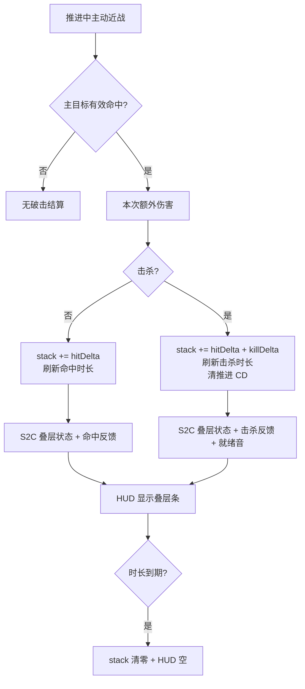

# 推进破击升级项实施方案

> 文档定位：汇总原始需求、多轮澄清与试玩反馈，并与代码库现状对照。正文业务名统一为 **「推进破击」**；历史文件名「冲刺攻击」仅作检索保留。本文分为「PRD Break」与「改造方案」两部分。
>
> **版本说明（2026-07-23）**：本版将已落地能力与待做「叠层 HUD」写清；并记录连杀手感反馈（叠层需可视化、秒杀节奏仍偏慢）作为后续调参输入。

## 原始需求

> 仅结构化整理需求方描述；歧义见「已确认 / 待确认」。

1. 在冲刺（推进）过程中，如果**攻击到了**生物，则会提高攻击力。
2. 攻击力提高程度按照推进装备的品质等级依次提升。
3. 若击杀目标，直接重置突进器冷却时间。
4. 击中目标：攻击力提升持续一段时间；击杀：攻击力大幅上升。
5. 命中要有反馈，让玩家感知破击加成。

### 多轮澄清与迭代口径（按时间收敛）

| 主题 | 结论 | 状态 |
|---|---|---|
| 推进是否自动伤人 | **否**；必须玩家主动近战 | 已确认并实现 |
| 业务命名 | **推进破击**；物品 ID `boost_strike_upgrade` | 已确认并实现 |
| 命中模型 | 近战主目标；非碰撞冲撞 | 已确认并实现 |
| 剑扫击次要目标 | 不结算破击加成；持剑可强制扩大横扫伤 | 已确认并实现 |
| 攻击增益时长 | 相对初稿 **+30%** | 已确认并实现 |
| 易命中 | 加长触及、贴身/锥形辅助锁定、服务端宽容校验 | 已确认并实现 |
| 命中/击杀反馈音效 | 加强；击杀另播冷却就绪音 | 已确认并实现 |
| 攻击力增益形态 | **叠层**：命中叠、击杀叠更多；有上限；到期整段清零 | 已确认并实现 |
| 叠层可视化 | **融合现有热键栏右侧推进 HUD**，展示当前叠层 | **本期待实现（本版设计重点）** |
| 连杀秒杀手感 | 试玩反馈：一尸约三次推进才死，叠层后仍难秒杀 | **观察中**；HUD 优先，数值可再调 |
| 破击判定窗口 | **推进中 + 推进结束后 1 秒（20 tick）** 内近战均算破击 | 已确认；避免推力结束瞬间挥砍叠层断裂 |

## 第一部分：PRD Break（需求理解与确认）

### 1. 业务背景

推进器护腿已具备等级、升级槽、推进物理、冷却 HUD（热键栏右侧竖条：冷却 + 耐久）、以及多项升级（空中冲刺、遁地、原地起飞、无冷却、随机推进等）。

推进破击目标：把推进从「纯位移」扩展为「位移 + 主动近战连杀节奏」——清 CD、叠攻击、可感知反馈。

**现状事实（代码已核验，2026-07-23）**：

- 升级项、破击结算、叠层属性、易命中、反馈音效 **已实现**。
- 热键栏右侧 HUD **仅**展示推进冷却充能与护腿耐久，**不**展示破击叠层。
- 叠层状态在服务端 `BoostStrikeHandler` 内存中；客户端 **无**权威叠层同步包，无法稳定做 UI。
- 试玩反馈：叠层存在但玩家难感知；连杀秒杀节奏仍偏肉（偏数值，非「击杀清空叠层」bug）。

### 2. 需求目标

- 安装推进破击后，推进中主动近战形成「命中叠伤 → 击杀清 CD → 再推进连杀」的闭环。
- 攻击力按护腿品质分档，**命中与击杀均可叠层**，上限与时长可理解。
- 命中/击杀有强反馈；击杀清冷却时播放冷却就绪音。
- **玩家能从现有推进 HUD 区域直接读出当前叠层进度与是否接近上限**（本期待做）。

### 3. 需求范围

#### 3.1 本期包含（能力全集，含已做与待做）

| 能力 | 说明 | 实现状态 |
|---|---|---|
| 升级项 | `BOOST_STRIKE` / `boost_strike_upgrade`，配方、lang、附魔书临时外观 | 已实现 |
| 破击结算 | ActiveBoost + 主目标近战：额外伤害 + 叠层加攻 + 击杀清 CD | 已实现 |
| 叠层规则 | 命中叠 `hit`；击杀叠 `hit+kill`；有 `maxStack`；到期清零 | 已实现 |
| 易命中 | 触及加成、辅助锁定、服务端宽容、持剑强制扩大横扫 | 已实现 |
| 反馈 | 命中/击杀音效粒子；击杀播就绪音 | 已实现 |
| **叠层 HUD** | 并入热键栏右侧推进 HUD；同步叠层量/上限/剩余时间 | **待实现** |

#### 3.2 本期不包含

- 推进碰撞自动伤害。
- 远程武器破击。
- 过热、摔落免疫等其它升级。
- 独立大面板 / 聊天刷屏叠层提示。
- PvP 专项平衡、领地插件深度对接。
- 升级项正式贴图（仍可用临时附魔书外观）。
- **强制一刀秒杀**调参（可在叠层 HUD 落地后根据可读性再调数值；不作为本版 P0）。

### 4. 角色与名词

| 名词 | 本文定义 |
|---|---|
| 推进 / ActiveBoost | `BoosterMotionTicker` 持续推力期间 |
| 破击窗口 | ActiveBoost **或** 推进结束后宽限 20 tick（1 秒）内；仅此窗口结算破击/叠层/易命中 |
| 推进破击 | 已装升级且处于破击窗口时，主动近战触发的额外伤害、叠层加攻、击杀清 CD 与反馈 |
| 主目标 | 本次攻击锁定的主要 LivingEntity；横扫次要目标不拿破击叠层 |
| 叠层值 `stackAmount` | 当前累计的攻击力加成（加到 `ATTACK_DAMAGE` 的临时修饰） |
| 叠层上限 `maxStack` | 品质相关上限（铜 24 … 下界合金 40） |
| 叠层剩余时间 | 距整段叠层清零的剩余 tick；每次叠层刷新 |
| 推进 HUD | 热键栏右侧竖向面板（现状：冷却条 + 耐久条） |

### 5. 主业务流程

1. 合成并安装推进破击升级项。
2. 装备护腿，按 Z 进入推进。
3. 推进中主动近战（可借助辅助锁定）；主目标结算额外伤害与叠层。
4. 击杀：叠更多层 + 清推进冷却 + 强反馈 + 就绪音。
5. 玩家从 HUD 看到叠层上升/维持/到期归零（待做）。
6. 冷却清零后再次推进连杀；叠层在持续时间内跨多次推进保留。



### 6. 功能需求

#### 6.1 升级项与安装

- 与其它升级相同：槽位、同类型禁重、NBT 双轨。
- Tooltip 需说明：叠层、上限、击杀清 CD、非碰撞伤、HUD 可见（文案可在 HUD 落地后微调）。

#### 6.2 破击命中与额外伤害

##### 触发与前置

- 已装 `BOOST_STRIKE` 且处于**破击窗口**（`isBoosting` **或** 推进结束后 1 秒宽限内）。
- 主动近战命中主目标（辅助锁定可选中贴身/锥内目标）。
- 有效伤害（未完全格挡）。

##### 规则

- 追加品质相关 `bonusDamage`（当次伤害，不进入叠层条数值本身）。
- 横扫次要目标：可受伤，**不**叠层、不单独清 CD。

#### 6.3 攻击力叠层

##### 触发与前置

- 有效破击命中或击杀。

##### 规则（已确认）

| 事件 | 叠层增量 | 时长刷新 |
|---|---|---|
| 命中未击杀 | `+ hitAttackBonus` | 命中时长（78 tick） |
| 击杀 | `+ hitAttackBonus + killAttackBonus` | 击杀时长（130/156 tick） |

- `stackAmount = min(maxStack, stackAmount + delta)`。
- **不会**在击杀时清零叠层；仅时长到期或断线清零。
- 叠层加在**之后攻击**的攻击力上；当次伤害先结算再叠层。

##### 品质表（现状实现）

| 品质 | 当次额外伤害 | 命中增量 | 击杀附加增量 | 上限 |
|---|---|---|---|---|
| 铜 | 2 | 1.0 | 2.0 | 24 |
| 铁 | 3 | 1.5 | 3.0 | 28 |
| 金 | 4 | 2.0 | 4.0 | 32 |
| 钻石 | 6 | 3.0 | 5.0 | 36 |
| 下界合金 | 8 | 4.0 | 7.0 | 40 |

> 试玩：满血尸壳约 20 HP，铁剑连推三次才死，说明起手总伤仍偏紧。本版以 **HUD 可读性** 优先；数值上调另开调参，不阻塞 HUD。

#### 6.4 击杀重置冷却

- 破击致死 → `removeCooldown(推进器物品)`。
- 同时客户端击杀反馈中播放与「冷却转好」相同的就绪音。

#### 6.5 易命中（已确认）

- 推进中触及约 +3.5（总约 6.5）。
- 准星 MISS/方块时：贴身优先 + 视角锥辅助锁定。
- 服务端贴身包围盒 / 加长眼距宽容。
- 持剑强制横扫并扩大范围；破击叠层仍只算主目标。

#### 6.6 命中/击杀反馈（已确认）

- 命中：多层打击音 + 粒子 + 短镜头。
- 击杀：更强音效层 + 粒子 + 就绪音。

#### 6.7 叠层 HUD（待实现 · 本版设计）

##### 触发与前置

- 玩家装备推进器且 HUD 总开关开启（复用 `BoosterHudState`）。
- 未装推进破击：可不显示叠层条，或常显空槽（**建议：仅当护腿已装破击升级时显示叠层轨**，避免干扰未使用者）。

##### 展示规则

- **位置**：现有热键栏右侧推进 HUD 面板内扩展，不另起角落大面板。
- **信息**（最少）：
  1. 当前叠层相对上限的比例（主条填充）；
  2. 叠层剩余时间比例或倒计时感（次级表现：条顶光点 / 脉冲 / 第二条细轨）；
  3. 满层时有可区分高亮（颜色或顶光）。
- **可选**：极短数字（如 `12`）叠在条旁——像素风下数字易糊，**建议首版不做数字，只做条**；若试玩需要再加。
- **无叠层**（stack=0）：叠层轨为空底，不占错误状态。
- **隐藏 GUI**（F1）时与现 HUD 一并隐藏。

##### 成功 / 失败

- 服务端叠层变化后，客户端 HUD 在下一同步周期内反映新值（目标：同一 tick 或下一客户端帧可见）。
- 断线/到期：客户端叠层归零显示。

### 7. 验收标准

> 保留历史 AC 编号语义；新增 AC 从 **AC-22** 起。测试结果初始为「未执行」。已实现能力可在联调后回填。

#### 7.1 升级项与基础破击

| 编号 | 给定 | 当 | 则 | 测试结果 |
|---|---|---|---|---|
| AC-01 | 有配方材料 | 合成 | 获得推进破击升级项；创造页可见；tooltip 说明主动近战/叠层/清 CD | 未执行 |
| AC-02 | 手持推进器 | 装入升级槽 | NBT 含 `BOOST_STRIKE` | 未执行 |
| AC-03 | 槽内已有一件破击 | 再放同类型 | 无法放入 | 未执行 |
| AC-04 | 未装破击 | 推进中近战命中 | 无额外伤害、无叠层、不清 CD | 未执行 |

#### 7.2 命中与品质

| 编号 | 给定 | 当 | 则 | 测试结果 |
|---|---|---|---|---|
| AC-05 | 已装破击且推进中 | 近战命中未击杀 | 有额外伤害、叠层增加、命中反馈 | 未执行 |
| AC-06 | 高品质 vs 低品质同条件 | 各命中一次 | 额外伤害与叠层增量随品质提高 | 未执行 |
| AC-07 | 已装破击且推进中 | 只碰撞不攻击 | 无破击效果 | 未执行 |
| AC-08 | 已装破击，未推进且已过结束后 1s 宽限 | 近战命中 | 无破击额外伤害与叠层 | 未执行 |
| AC-30 | 已装破击，推进刚结束不足 1s | 近战命中 | 仍结算破击额外伤害与叠层（宽限有效） | 未执行 |
| AC-31 | 已装破击，推进结束后满 1s | 近战命中 | 不再结算破击 | 未执行 |

#### 7.3 叠层

| 编号 | 给定 | 当 | 则 | 测试结果 |
|---|---|---|---|---|
| AC-09 | 叠层为 0 | 连续两次推进命中未击杀 | 叠层为 2×命中增量（未超上限） | 未执行 |
| AC-10 | 已有叠层 | 破击击杀 | 叠层增加命中+击杀增量，且**不清零**既有叠层 | 未执行 |
| AC-11 | 叠层接近上限 | 再次命中/击杀 | 叠层不超过品质 `maxStack` | 未执行 |
| AC-12 | 叠层>0 | 等待超过刷新后的剩余时间 | 叠层归零，攻击力修饰消失 | 未执行 |
| AC-13 | 击杀后叠层仍在 | 再次推进命中 | 可在已有叠层上继续叠加 | 未执行 |

#### 7.4 冷却与反馈

| 编号 | 给定 | 当 | 则 | 测试结果 |
|---|---|---|---|---|
| AC-14 | 推进后在冷却中 | 破击击杀 | 冷却清零；可再推进；可听见就绪音 | 未执行 |
| AC-15 | 命中未击杀 | 观察冷却 | 不因命中清 CD | 未执行 |
| AC-16 | 推进中弓箭击杀 | 箭杀 | 不清推进 CD、不叠破击层 | 未执行 |
| AC-17 | 破击命中 | 听/看 | 命中音效强于普攻感；击杀更强 | 未执行 |

#### 7.5 易命中

| 编号 | 给定 | 当 | 则 | 测试结果 |
|---|---|---|---|---|
| AC-18 | 推进破击中，准星略偏或对地 | 攻击 | 贴身/锥内目标仍可被锁定攻击 | 未执行 |
| AC-19 | 推进破击持剑 | 命中主目标旁有其它怪 | 横扫可伤次要；仅主目标叠层 | 未执行 |

#### 7.6 叠层 HUD（待实现）

| 编号 | 给定 | 当 | 则 | 测试结果 |
|---|---|---|---|---|
| AC-22 | 已装破击，HUD 开启，叠层为 0 | 观察热键栏右侧推进 HUD | 可见叠层轨且为空；冷却/耐久仍正常 | 未执行 |
| AC-23 | 叠层从 0 升到中间值 | 破击命中 | 叠层轨填充比例约等于 stack/maxStack；与冷却条可区分 | 未执行 |
| AC-24 | 叠层>0 | 等待接近到期 | 剩余时间表现可感知（细轨或顶光衰减） | 未执行 |
| AC-25 | 叠层到期 | 观察 HUD | 叠层轨归零，与属性加成消失一致 | 未执行 |
| AC-26 | 叠层达上限 | 再命中 | 条满且有满层高亮；数值不再增加 | 未执行 |
| AC-27 | 未装破击仅装其它升级 | 观察 HUD | 不显示叠层轨（或与「无破击」口径一致） | 未执行 |
| AC-28 | HUD 总开关关闭 / F1 | 观察 | 整块推进 HUD（含叠层）不显示 | 未执行 |
| AC-29 | 击杀清 CD 时 | 看冷却条 + 叠层条 | 冷却变满且叠层升高，两者同步可读 | 未执行 |

#### 7.7 构建

| 编号 | 给定 | 当 | 则 | 测试结果 |
|---|---|---|---|---|
| AC-21 | 工程可编译 | `./gradlew build` | BUILD SUCCESSFUL | 未执行 |

### 8. 核心业务规则

- **权威**：叠层与清 CD 仅服务端；客户端 HUD 只展示同步快照。
- **窗口**：破击结算与叠层仅在 **ActiveBoost 或结束后 1s 宽限** + 已装升级。
- **叠层**：可叠加、有上限、刷新时长、到期整清；击杀不清层。
- **主目标**：仅主目标叠层与破击清 CD。
- **HUD**：叠层展示并入热键栏右侧推进 HUD；未装破击不展示叠层轨（建议口径）。

### 9. 页面与数据对象影响

#### 9.1 页面 / HUD 矩阵

| 端 | 场景 | 改造 |
|---|---|---|
| 客户端 | 热键栏右侧推进 HUD | **扩展**：冷却 + **叠层** + 耐久（三轨或等效） |
| 客户端 | 破击反馈 | 已有；可与叠层升高同步 |
| 客户端 | 升级界面 / tooltip | 已有；可补「HUD 显示叠层」一句 |
| 服务端 | 无页面 | 叠层状态 S2C |

#### 9.2 数据对象矩阵

| 对象 | 调整 | 来源/去向 | 历史策略 | 状态 |
|---|---|---|---|---|
| 升级类型 `BOOST_STRIKE` | 已有 | 物品/NBT | 无则无能力 | 已实现 |
| `stackAmount` / deadline | 服务端内存 | 命中叠层；tick 到期 | 不落盘 | 已实现 |
| 叠层同步包 | **新增** | 服务端→客户端 HUD | 旧客户端忽略 | 待实现 |
| 推进 HUD 布局 | 加叠层轨 | 客户端渲染 | 兼容开关 | 待实现 |

### 10. 异常与边界

- 未装破击 / 未推进：无叠层变化。
- 盾挡 0 伤：不叠层。
- 横扫次要：不叠层。
- 断线：清叠层；重进为 0。
- 叠层同步丢包：以下一次叠层变化或周期性全量纠正（见技术方案）。
- HUD 关闭：不渲染；服务端叠层逻辑不受影响。

### 11. 非功能

- 服务端权威；同步包轻量（叠层变化时发送，可选 10～20 tick 心跳）。
- HUD 绘制复杂度与现面板同级，避免每帧分配。
- 构建：`./gradlew build`。

### 12. 已确认事项

| 优先级 | 问题 | 确认结论 | 来源 |
|---|---|---|---|
| P0 | 触发方式 | 推进中主动近战，非碰撞 | 用户澄清 |
| P0 | 升级项 | `boost_strike_upgrade` | 用户确认 |
| P0 | 叠层 | 命中叠、击杀叠更多、有上限、到期清 | 用户确认 |
| P0 | 击杀是否清叠层 | **否** | 代码+分析确认 |
| P0 | 叠层 UI | 融合热键栏右侧现有推进 HUD | 用户当轮 |
| P0 | 破击时间窗 | 推进中 + **结束后 1s** 内均算破击 | 用户确认（防叠层断裂） |
| P1 | 时长 +30% | 是 | 用户确认 |
| P1 | 易命中/强反馈 | 是 | 用户确认+试玩 |
| P1 | 扫击次要破击 | 否 | 用户确认 |
| P2 | 文件名 | 保留「冲刺攻击」文件名 | 用户确认 |

### 13. 待确认事项

| 优先级 | 待确认问题 | 影响 | 建议口径 | 状态 |
|---|---|---|---|---|
| P1 | 叠层轨是否显示精确数字 | UI 信息密度 | **首版只条不数字** | 建议待确认 |
| P1 | 无破击升级时是否占位第三轨 | HUD 宽度 | **不显示叠层轨，面板保持双轨** | 建议待确认 |
| P2 | 连杀秒杀数值是否上调 | 手感 | HUD 落地后再调 `bonusDamage`/增量 | 不阻塞 HUD |

> 建议口径可作为实现默认；若无反对，门禁视为通过。

### 14. 上游依赖与参考资料

- 原始需求与多轮对话澄清。
- 进度：`docs/推进破击开发进度跟进.md`。
- 代码：`combat/*`、`BoosterCooldownHud` / `BoosterHudRenderer`、`BoosterStrikeFeedback*`、`BoostStrikeSupport`、`PlayerAttackMixin`、`MinecraftAttackMixin`。

### 15. PRD Break 结论

推进破击主干（结算、叠层、易命中、反馈）已定版并基本落地。**下一开发切片**是：服务端叠层状态同步 + 热键栏右侧 HUD 融合展示。  
P0 无阻塞项；P1 展示细节可按建议默认实现。

**可进入技术方案 / 可开工 HUD 切片。**

---

## 第二部分：改造方案（技术方案）

### 16. 方案目标与设计原则

- **可感知连杀**：叠层变化必须在 HUD 上可读，解决「不知道叠了没有」。
- **最小侵入 HUD**：在现有 12×22 右侧面板上扩展，不新开屏幕坐标系大部件。
- **服务端权威**：叠层以服务端为准；客户端只渲染快照。
- **已实现逻辑复用**：不重写破击结算，只补同步与渲染。

### 17. 系统边界与改造范围

| 模块 | 现有职责 | 本期（HUD 切片） | 现状依据 |
|---|---|---|---|
| `BoostStrikeHandler` | 叠层、清 CD、反馈包 | 叠层变化时广播状态包；可读当前 stack/max/剩余 | 服务端 Map |
| 网络 | 命中反馈 `BoosterStrikeFeedbackPayload` | **新增**叠层状态 S2C | 尚无 stack 同步 |
| `BoosterCooldownHud` / `BoosterHudRenderer` | 冷却+耐久 | 条件显示叠层轨；三轨布局 | 热键栏右侧 |
| 客户端状态 | 触及窗口等 | 缓存 stack 快照 | 待加 |
| 破击结算/易命中 | 已完成 | **不改算法**（除非同步钩子） | — |

不改造：升级菜单布局、平衡 JSON 大改、独立 buff 图标系统。

### 18. 整体架构与数据流


### 19. 领域字段与同步设计

#### 19.1 字段

| 业务 | 服务端 | 网络 | 客户端 |
|---|---|---|---|
| 当前叠层 | `ATTACK_STACK` | `stackAmount` float | snapshot |
| 上限 | 由 tier profile | `maxStack` float | snapshot |
| 剩余 tick | `deadline - now` | `remainingTicks` int | snapshot |
| 是否有破击升级 | hasUpgrade | 可推：`maxStack>0` 或单独 bool | 控制是否画叠层轨 |

#### 19.2 同步包（设计）

建议新建：`BoosterStrikeStackPayload(stackAmount, maxStack, remainingTicks)`  

发送时机：

1. 叠层增加时；
2. 叠层清零时（到期/断线清理后若玩家仍在线）；
3. 可选：玩家加入或装备变化时发 0；
4. 可选：每 20 tick 若 stack>0 心跳，防丢包。

**不**把叠层塞进 `BoosterStrikeFeedbackPayload`，以免反馈与 HUD 耦合过死；可同帧连发两包。

### 20. 核心业务流程

#### 20.1 叠层结算（已实现，保持）

1. 有效破击命中 → 额外伤害 → `stack += delta` 封顶 → 刷新 deadline → 属性修饰。  
2. 到期 tick → `clearAttackStack`。  
3. 击杀 → 额外 delta + `removeCooldown`。

#### 20.2 同步（已实现）

1. 在 `stackAttackBuff` / `clearAttackStack` 末尾调用 `syncStack(player)`。  
2. 客户端收包写入 `BoostStrikeStackState`。  
3. HUD 每帧读取 snapshot 渲染。  
4. 加入世界时下发 0 快照；叠层存活期间每 20 tick 心跳。

#### 20.3 HUD 渲染（已实现）

**布局建议（设计决策）**：

```
现: [冷却细轨 | 耐久宽轨]  宽 12
新: [冷却 | 叠层 | 耐久]     宽 16～18
```

- 有破击升级：三轨。  
- 无破击升级：保持原双轨宽度与逻辑（避免占位空白）。  

**叠层轨表现**：

- 填充高度 = `stackAmount / maxStack`（max≤0 时不画）。  
- 颜色：低层琥珀/紫红，满层亮品红或电光青，与冷却蓝、耐久绿区分。  
- 剩余时间：在叠层轨顶部画 1px 高亮或第二条 1px 宽「寿命」指示，长度 ∝ `remainingTicks / lastAppliedDuration`（客户端可用收包时的 remaining 做衰减估计，或仅显示收包值并在本地按 tick 递减至 0）。  

**本地递减（设计决策）**：收包后客户端每 tick `remainingTicks = max(0, remaining-1)`，归零时将显示 stack 置 0，避免条满时间假死；服务端到期清属性后会再发 0 包纠正。

### 21. 接口改造清单

| 能力 | 方向 | 入参/出参 | 处理 | 兼容 |
|---|---|---|---|---|
| 叠层状态 | S2C 新 payload | stack, max, remainingTicks | 叠层变更时发送 | 旧客户端未注册则忽略 |
| 命中反馈 | 已有 S2C | kill bool | 不变 | — |
| 推进请求 | C2S 已有 | 无 | 不变 | — |

### 22. 前端与交互改造

#### 22.1 推进 HUD

- `BoosterCooldownHud`：若已装破击，取 stack snapshot 传入 renderer。  
- `BoosterHudRenderer`：重载/扩展 `render(..., stackRatio, timeRatio, showStack)`。  
- 检测破击升级：客户端读护腿 `BoosterUpgradeHelper.hasUpgrade`（本地 NBT 可读）。

#### 22.2 无新键位、无新屏幕

仅展示。

### 23. 兼容性、异常与一致性

#### 23.1 历史与版本兼容

- 叠层与 deadline **不落盘**：旧存档/重进世界叠层为 0，无历史数据迁移。  
- 旧客户端无 StackState 包：忽略即可，破击玩法仍以服务端属性为准。  
- 旧护腿无 `BOOST_STRIKE`：行为与加装前一致，HUD 保持双轨。

#### 23.2 错误与边界

- 混合版本：服务端有叠层、旧客户端无 UI，玩法仍成立。  
- 属性同步与 UI 双轨：以 stack 包为准做条；属性负责真实伤害。  
- 丢包：心跳或下次命中纠正。  
- 无破击升级却残留 snapshot：装备检测时强制显示关闭并清本地 snapshot。

#### 23.3 一致性和幂等

- 同一玩家对同一目标同一 tick 破击结算至多一次（`SETTLED` 防重）。  
- `stackAttackBuff` 对同一结算只加一次 delta；同步包可重复发送相同快照（客户端幂等覆盖）。  
- 到期清层与断线清层均可重复调用，结果均为 stack=0。

### 24. 发布、回滚与验证

#### 24.1 发布顺序

1. 注册 StackStatePayload + 服务端 sync 钩子。  
2. 客户端状态与 HUD 三轨。  
3. 构建与 AC-22～AC-29 手测。  
4. （可选后续）按 HUD 观察调高 `bonusDamage` / 叠层增量。

#### 24.2 回滚

回滚 jar；叠层逻辑无持久化，无数据迁移。

#### 24.3 核心验证点

- 叠层条与真实伤害增益同向变化。  
- 击杀：冷却条满 + 叠层升高。  
- 到期：条与伤害加成同失。  
- 未装破击：HUD 不出现叠层轨。

### 25. 需求追踪矩阵

| 需求 | 设计落点 | 影响 | 验证 | 状态 |
|---|---|---|---|---|
| 主动近战破击 | §6.2 / 已实现 Handler | 近战钩子 | AC-05～08 | 已覆盖实现 |
| 品质分档 | §6.3 表 | Profile | AC-06 | 已覆盖实现 |
| 叠层 | §6.3 / Handler | 属性+Map | AC-09～13 | 已覆盖实现 |
| 击杀清 CD | §6.4 | Cooldowns | AC-14 | 已覆盖实现 |
| 易命中 | §6.5 | Support/Mixin | AC-18～19 | 已覆盖实现 |
| 强反馈 | §6.6 | Feedback | AC-17 | 已覆盖实现 |
| 叠层 HUD | §6.7 / §20.3 | 新 S2C+Renderer | AC-22～29 | **代码已实现，待手测** |
| 非碰撞 | §3.2 | — | AC-07 | 已覆盖 |

### 26. 本期不实现的技术能力

- 碰撞自动伤害、远程破击。  
- 独立大 HUD / 数字层叠层（首版）。  
- 强制改数值到「一刀一个尸壳」（可后续）。  
- 正式升级贴图。  

### 27. 已实现 vs 待办切片（给开发用）

| 切片 | 内容 | 状态 |
|---|---|---|
| A | 升级项与注册资源 | 已完成 |
| B | 破击结算 + 清 CD | 已完成 |
| C | 叠层属性 | 已完成 |
| D | 易命中 | 已完成 |
| E | 音效反馈 | 已完成 |
| **F** | **StackState S2C + 热键栏右侧叠层轨 HUD** | **已完成（待手测）** |
| G | 连杀数值调参（可选） | 观察 |

### 28. HUD 线框（实现参考，非美术定稿）

```
热键栏右侧（示意，有破击时）：

  ┌──┬──┬────┐
  │CD│ST│DUR │   CD=冷却  ST=叠层  DUR=耐久
  │  │▓▓│    │   ST 自下而上填充 = stack/max
  │  │▓▓│    │   顶缘高亮宽度或亮度 = 剩余时间
  │  │  │    │
  └──┴──┴────┘
```

满层：ST 轨使用高亮色 + 顶缘常亮脉冲。  
无叠层：ST 仅底槽。  
无破击升级：退回原 `CD | DUR` 双轨。
