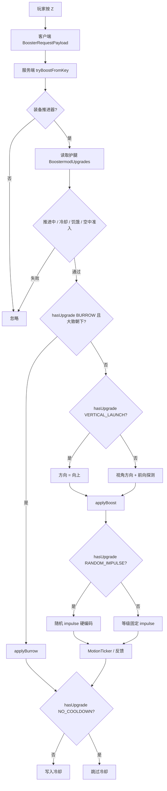

# 多特性升级项化实施方案

> 文档定位：基于用户当轮指示（将「向下掘地 / 无冷却 / 原地起飞 / 随机推进距离」做成与空中冲刺同类的升级项）与代码库现状核验整理；并纳入已确认结论（全局开关退场、同类型禁重、配方与临时附魔书 UI、遁地大致朝下触发等）。本文分为“PRD Break（需求理解与确认）”和“改造方案（技术方案）”两部分。范围仅覆盖上述四项能力的升级项化，不扩展过热、推进伤害等其它升级设想。

## 原始需求

> 仅结构化整理需求方原始描述，不额外扩展范围；歧义统一收敛到“待确认事项”。

当前推进器 mod 已实现若干额外特性，包括：

1. **向下掘地**：触发推进时向下破方下潜。
2. **无冷却**：推进后不进入冷却。
3. **原地起飞**：推进方向固定为垂直向上。
4. **随机推进距离**：每次推进随机生成本次 impulse。

以上能力需要像已有的 **空中冲刺（Air Dash）** 一样，做成可放入推进器升级槽位的 **升级项物品**；玩家只有在护腿上安装对应升级项后，才获得该能力。

补充设计：

- 遁地在已安装升级的前提下，仅当玩家**大致面朝地面**时触发，用于可控穿透地面；不要求严格俯视 90°。
- 升级项正式贴图未就绪前，临时采用**附魔书外观 + 说明文案**作为 UI 占位（不是做成附魔系统）。

## 第一部分：PRD Break（需求理解与确认）

> 核心目标是理解并确认需求，保证准确性和完整性；不清晰内容形成待办跟踪确认。

### 1. 业务背景

推进器护腿已具备：

- 等级系统（铜 → 下界合金）与升级槽位（按等级 2～6 格）。
- 空中冲刺升级项：物品合成 → 放入升级界面 → 服务端读取护腿 NBT 判定是否允许空中推进。
- 四项实验特性（遁地 / 垂直起飞 / 无冷却 / 随机 impulse）：以服务端全局开关实现，默认关闭，通过 `/boostermod feature ...` 持久化到 `config/boostermod-features.json`。

现状问题：

- 四项能力是「整服开关」，不是「单件装备能力」，与空中冲刺升级项模型不一致。
- 旧遁地开启后会无条件覆盖其它方向类推进，玩家无法在装有遁地时主动选择普通推进或原地起飞。

### 2. 需求目标

- 玩家可通过合成获得四类升级项，并安装到推进器护腿升级槽中启用对应能力。
- 未安装某升级项时，该能力对玩家不可用（与空中冲刺同一准入模型）。
- 装有遁地升级时，玩家通过**朝下瞄准**主动穿透地面；朝其它方向时走普通推进或原地起飞。
- 能力数值与资源消耗尽量沿用现状；启用判定仅来自装备升级项。

### 3. 需求范围

#### 3.1 本期包含

- 新增四类升级项物品：遁地、原地起飞（垂直起飞）、无冷却、随机推进距离。
- 扩展升级类型枚举与物品注册、创造模式页签展示、语言文案、合成配方。
- 升级项临时 UI：外观复用附魔书样式，并带能力说明 tooltip（非附魔玩法）。
- 将推进触发链路中对 `BoosterFeatureSettings` 的启用判定，改为对对应 `BoosterUpgradeType` 的装备校验。
- 遁地增加「大致朝下」视角条件；未满足时回落到其它推进模式。
- 升级槽禁止放入相同类型升级项。
- **删除**全局特性命令的运行时依赖；能力仅看升级项。
- 给出验收用例与发布验证点。

#### 3.2 本期不包含

- 过热机制、推进带伤害、推进后无视摔落伤害等其它升级设想。
- 调整护腿各等级升级槽数量。
- 调整遁地深度、随机 impulse 数值区间、冷却 tick 数等平衡参数（除非验收发现必须微调）。
- 客户端 HUD / 聊天提示当前已启用升级列表。
- 随机 impulse 上下限可配置化（保持硬编码 `0.1～1.0`）。
- 升级项正式自定义贴图（本期用附魔书临时外观）。
- 多人权限、区域保护插件兼容的专门改造。
- 新增特殊技巧（hyper / chain / wavedash 等）玩法。

### 4. 角色与名词

| 名词 | 本文定义 |
|---|---|
| 推进器护腿 | 可装备（盔甲腿部或 Trinkets `legs/booster`）并按 Z 触发推进的物品 |
| 升级项 | 可放入护腿升级槽的独立物品；安装后赋予单一能力 |
| 空中冲刺升级 | 已实现参考模型：`AIR_DASH` / `air_dash_upgrade` |
| 向下掘地 / 遁地 | 已装遁地升级且大致朝下时：向下破方下潜，最多 6 格，用于穿透地面 |
| 大致朝下 | 玩家视角相对水平面向下达到阈值角度；不要求严格俯视 90° |
| 原地起飞 / 垂直起飞 | 现状 `vertical_launch`：推进方向固定向上 |
| 无冷却 | 跳过冷却检查与冷却写入 |
| 随机推进距离 | 随机覆盖本次 impulse（硬编码 `[0.1, 1.0)`） |
| 附魔书临时 UI | 升级项外观临时使用原版附魔书模型/材质观感 + 自定义名称与说明；**不是**附魔系统 |
| 全局特性开关 | 旧 `/boostermod feature` + `boostermod-features.json`（本期删除运行时依赖） |

### 5. 主业务流程

1. 玩家合成或获取某升级项物品（外观为附魔书样式，名称与 tooltip 标明具体能力）。
2. 手持推进器护腿使用（非潜行）打开升级界面；按护腿等级显示可用槽位。
3. 将升级项放入可用槽位（同类型不可重复）；关闭或槽位变化时写入护腿 NBT（`BoostermodUpgrades`）。
4. 玩家装备该护腿并按 Z 请求推进；服务端读取已安装升级项与当前视角。
5. 通过冷却 / 饥饿 / 推进中互斥 / 空中冲刺准入后：
   - 若有遁地升级且大致朝下 → 执行遁地；
   - 否则若有原地起飞 → 垂直向上推进；
   - 否则按视角普通推进；随机 impulse / 无冷却按升级叠加。
6. 成功则消耗资源并反馈；遁地 0 格失败则不耗资源、不写冷却。

### 6. 功能需求

#### 6.1 升级项物品与安装

##### 6.1.1 触发与前置条件

- 任意玩家可合成并持有升级项；安装时必须手持推进器护腿并打开升级界面。
- 木/石等无槽位等级仍不可安装（现状：铜起才有槽位）。

##### 6.1.2 展示与处理规则

- 每类能力对应一件独立升级物品与独立升级类型。
- 升级项 `stacksTo(1)`，槽位最大堆叠 1。
- **临时 UI**：物品模型/贴图采用附魔书样式；显示自定义物品名；tooltip 展示对应能力说明（含遁地「朝下触发」提示）。不是附魔，不可用于附魔台。
- **禁止**同一升级类型重复放入多个槽位。
- 安装后效果绑定该护腿实例；卸下后立即失去对应能力。
- 已有空中冲刺升级项本期一并改为同一临时 UI 规范（可选但建议统一观感）。

#### 6.2 向下掘地升级

##### 6.2.1 触发与前置条件

- 护腿已安装遁地升级。
- 玩家触发推进且通过冷却、饥饿、推进中互斥等通用校验。
- 空中触发仍需空中冲刺升级（遁地不豁免空中准入）。
- **视角条件**：玩家大致面朝地面（`pitch >= 60°`）；不满足则**不进入**遁地分支。

##### 6.2.2 展示与处理规则

- 同时满足「已安装 + 大致朝下」时执行遁地，用于穿透脚下可破坏方块。
- 下潜行为保持现状：最多 6 格；破坏路径上可破坏方块；遇不可破坏/边界/实体/无法容纳则提前停止。
- 下潜格数 ≤ 0 时失败，不消耗资源、不写冷却。
- 已装遁地但未朝下时：回落到原地起飞或普通推进。
- 成功后仍受无冷却升级影响是否写入冷却。

#### 6.3 原地起飞升级

##### 6.3.1 触发与前置条件

- 已安装原地起飞升级；本次未进入遁地分支（无遁地升级，或有遁地但未大致朝下）。

##### 6.3.2 展示与处理规则

- 推进方向固定为 `(0, 1, 0)`，不再使用视角方向与前向探测失败拦截。
- 仍消耗饥饿/耐久，仍可触发反馈与冷却规则。

#### 6.4 无冷却升级

##### 6.4.1 触发与前置条件

- 已安装无冷却升级。

##### 6.4.2 展示与处理规则

- 跳过「冷却中不可推进」检查，且成功推进后不写入冷却。
- 不取消「正在推进中不可重复触发」保护。
- 可叠加到遁地、原地起飞、普通推进、空中冲刺。

#### 6.5 随机推进距离升级

##### 6.5.1 触发与前置条件

- 已安装随机推进距离升级；本次进入普通推进或原地起飞路径（非遁地）。

##### 6.5.2 展示与处理规则

- 每次推进随机生成本次 `impulse ∈ [0.1, 1.0)`（硬编码，本期不可配置）；`thrustPerTick` / `thrustTicks` 仍取当前等级平衡配置。
- 不影响遁地深度。
- Hyper 对 impulse 的处理沿用现状 `BoosterMotionTicker`。

#### 6.6 全局特性开关退场

##### 6.6.1 触发与前置条件

- 管理员曾使用 `/boostermod feature` 或存在 `boostermod-features.json`。

##### 6.6.2 展示与处理规则

- **已确认**：删除运行时依赖；**移除** `/boostermod feature` 命令；能力仅看升级项。
- 旧配置文件可残留在磁盘，但不再读取、不再生效。

### 7. 验收标准

> 每个本期需求或能力建立一个小节；一个需求可对应多个验收用例。编号必须全文唯一且保持稳定。首次生成时“测试结果”统一填写“未执行”，后续验收回填“通过”“不通过”“阻塞”或“不适用”。

#### 7.1 升级项获取与安装

| 编号 | 给定 | 当 | 则 | 测试结果 |
|---|---|---|---|---|
| AC-01 | 玩家在有工作台的环境下拥有遁地升级配方材料 | 按配方合成 | 获得 1 个遁地升级项；创造页签可见四件新升级项；外观为附魔书样式且带能力说明 | 未执行 |
| AC-02 | 玩家手持铁推进器护腿（3 槽） | 打开升级界面并放入无冷却升级 | 关闭界面后再次打开，该槽仍显示无冷却升级；护腿 NBT 含对应升级 | 未执行 |
| AC-03 | 玩家手持铜推进器护腿，槽位已满 | 尝试再放入超出可用槽位的升级项 | 无法放入 | 未执行 |
| AC-03b | 玩家手持钻石推进器，槽内已有一件空中冲刺升级 | 再向另一空槽放入第二件空中冲刺升级 | 无法放入（同类型禁止重复） | 未执行 |

#### 7.2 向下掘地

| 编号 | 给定 | 当 | 则 | 测试结果 |
|---|---|---|---|---|
| AC-04 | 护腿已装遁地升级，脚下为可破坏方块，玩家大致朝下，地面站立且可推进 | 按 Z 触发推进 | 玩家向下破方下潜，最多 6 格；产生音效/粒子；消耗饥饿与耐久 | 未执行 |
| AC-05 | 护腿未装遁地升级，玩家大致朝下，其它条件同可推进场景 | 按 Z 触发推进 | 不破方下潜；按其它已装升级或普通视角推进 | 未执行 |
| AC-06 | 护腿同时装遁地与原地起飞，玩家大致朝下 | 按 Z 触发推进 | 执行遁地，不垂直起飞 | 未执行 |
| AC-07 | 护腿已装遁地升级，玩家大致朝下，脚下为基岩等不可破坏方块 | 按 Z 触发推进 | 不产生下潜，不消耗资源，不进入冷却 | 未执行 |
| AC-20 | 护腿已装遁地升级，玩家面朝水平或朝上（未达大致朝下阈值） | 按 Z 触发推进 | 不触发遁地；走普通推进或原地起飞（若已安装） | 未执行 |
| AC-21 | 护腿同时装遁地与原地起飞，玩家面朝水平 | 按 Z 触发推进 | 执行原地起飞，不遁地 | 未执行 |
| AC-22 | 护腿已装遁地，玩家俯视角略大于阈值（如刚超过 60°） | 按 Z 触发推进 | 可触发遁地（不要求严格 90° 俯视） | 未执行 |

#### 7.3 原地起飞

| 编号 | 给定 | 当 | 则 | 测试结果 |
|---|---|---|---|---|
| AC-08 | 护腿已装原地起飞、未装遁地；玩家面朝水平方向 | 按 Z 触发推进 | 玩家沿垂直向上推进，不按视角水平冲出 | 未执行 |
| AC-09 | 护腿未装原地起飞与遁地 | 按 Z 触发推进 | 仍按视角方向推进 | 未执行 |

#### 7.4 无冷却

| 编号 | 给定 | 当 | 则 | 测试结果 |
|---|---|---|---|---|
| AC-10 | 护腿已装无冷却升级，且不在推进中 | 连续两次成功触发推进（间隔短于原 60 tick） | 第二次仍可成功触发；物品不进入冷却条 | 未执行 |
| AC-11 | 护腿未装无冷却升级 | 成功推进一次后立即再按 Z | 第二次被冷却拦截，不推进 | 未执行 |
| AC-12 | 护腿已装无冷却，当前正处于推进运动中 | 再按 Z | 不重复开启新推进 | 未执行 |

#### 7.5 随机推进距离

| 编号 | 给定 | 当 | 则 | 测试结果 |
|---|---|---|---|---|
| AC-13 | 护腿已装随机推进距离；本次未进入遁地 | 连续多次成功普通或原地起飞推进 | 各次初速/位移出现可观察差异；不改变 thrustTicks 配置本身 | 未执行 |
| AC-14 | 护腿已装随机推进距离与遁地，玩家大致朝下并遁地成功 | 观察下潜深度 | 最多 6 格，不因随机 impulse 改变 | 未执行 |
| AC-15 | 护腿未装随机推进距离 | 多次普通推进 | 位移量符合当前等级固定 impulse 配置 | 未执行 |

#### 7.6 与空中冲刺的组合

| 编号 | 给定 | 当 | 则 | 测试结果 |
|---|---|---|---|---|
| AC-16 | 护腿仅装遁地，未装空中冲刺，玩家离地且大致朝下 | 按 Z | 不推进（空中准入失败） | 未执行 |
| AC-17 | 护腿装空中冲刺 + 原地起飞，玩家离地 | 按 Z | 允许空中垂直起飞 | 未执行 |
| AC-23 | 护腿装空中冲刺 + 遁地，玩家离地且大致朝下，脚下有可破坏方块可下潜 | 按 Z | 允许空中触发遁地穿透 | 未执行 |

#### 7.7 全局开关退场 / 兼容

| 编号 | 给定 | 当 | 则 | 测试结果 |
|---|---|---|---|---|
| AC-18 | 旧存档存在 `boostermod-features.json` 且曾开启全部特性，但护腿无对应升级项 | 加载新版本并触发推进 | 不因旧配置获得遁地/垂直起飞/无冷却/随机 impulse | 未执行 |
| AC-18b | 管理员在新版本执行 `/boostermod feature ...` | 输入命令 | 命令不存在或不可用（已移除） | 未执行 |
| AC-19 | 执行 `./gradlew build` | 构建完成 | `BUILD SUCCESSFUL`，新升级项资源被打包进 jar | 未执行 |

### 8. 核心业务规则

- **启用权威**：某能力是否生效，以当前装备推进器护腿上已安装升级项为准（服务端读取）。
- **遁地触发**：`hasUpgrade(BURROW)` **且** `pitch >= 60°` 同时成立才进入遁地；否则不抢占其它模式。
- **模式选择顺序**：通用校验通过后 →（遁地升级且朝下 ? 遁地 :（原地起飞 ? 垂直向上 : 视角推进））；无冷却可叠加；随机 impulse 仅非遁地。
- **空中准入**：离地推进始终要求空中冲刺升级；其它升级不替代该校验。
- **资源消耗**：成功推进才消耗饥饿与耐久；遁地失败（0 格）不消耗。
- **冷却**：默认成功推进写入 60 tick；有无冷却升级则不检查、不写入。
- **同类型重复**：升级槽禁止放入已存在的相同 `BoosterUpgradeType`；生效判定按「有/无」布尔，不叠加。
- **随机 impulse**：硬编码 `[0.1, 1.0)`，本期不提供配置入口。
- **临时 UI**：附魔书外观 + 说明；正式贴图后续替换，不影响能力逻辑。
- **槽位容量**：能力搭配受护腿等级槽位数限制；本期不改槽位数。

### 9. 页面与数据对象影响

#### 9.1 页面改造矩阵

| 端 | 页面/场景 | 本期改造 |
|---|---|---|
| 客户端 | 推进器升级界面 | 接受四类新升级项；同类型禁重 |
| 客户端 | 物品外观 / Tooltip | 临时附魔书样式 + 各自能力说明 |
| 客户端 | 创造模式物品栏 / 合成 | 新增四物品与主题配方 |
| 服务端命令 | `/boostermod feature` | **移除**；不再驱动玩法 |
| 客户端 HUD | 冷却条 / 推进 HUD | 无冷却时表现为始终可充能；**不**新增升级状态 HUD / 聊天提示 |

#### 9.2 数据对象矩阵

| 数据对象 | 调整内容 | 数据来源与去向 | 历史策略 | 确认状态 |
|---|---|---|---|---|
| 升级类型枚举 | 新增 `BURROW` / `VERTICAL_LAUNCH` / `NO_COOLDOWN` / `RANDOM_IMPULSE` | 物品注册 → 护腿 NBT → 推进判定 | 无历史升级实例 | 已确认 |
| 护腿自定义 NBT `BoostermodUpgrades` | 可存新升级物品堆 | 升级菜单写入；推进读取 | 旧护腿无新升级则能力关闭 | 现状事实 |
| `boostermod-features.json` | 停止读取与生效 | 旧命令 | 文件可残留 | 已确认 |
| `/boostermod feature` | 命令移除 | — | 旧脚本失效 | 已确认 |
| 合成配方 / 语言 | 四套主题配方 + 命名说明 | 数据包 / assets | 无 | 已确认 |
| 升级项物品模型 | 临时指向附魔书外观 | assets model | 后续换正式贴图 | 已确认 |
| 遁地视角阈值 | 常量 `60°` | 服务端 pitch | 无 | 已确认（手感收紧） |

### 10. 异常与边界场景

- 未装备推进器：不响应。
- 推进中重复触发：忽略。
- 冷却中且无无冷却升级：忽略。
- 饥饿不足（非创造）：忽略。
- 空中无空中冲刺：忽略。
- 已装遁地但未朝下：不遁地，继续其它模式。
- 朝下遁地被阻挡（0 格）：失败返回，不耗资源；不回落为同一次按键的普通推进。
- 同类型升级再次放入：槽位拒绝。
- 升级项放在未激活槽位：仅 `activeSlots` 内生效。
- 客户端伪造推进包：服务端重校验升级、视角与资源。

### 11. 非功能要求

- **安全**：能力与朝下判定仅服务端；客户端不得单独开启特性。
- **兼容**：旧存档护腿无新升级时行为回退为「基础推进 + 可选空中冲刺」。
- **可维护**：四项能力判定与空中冲刺共用 `hasUpgrade`；遁地额外本地视角谓词。
- **构建**：`./gradlew build` 通过即可；项目无自动化测试。

### 12. 已确认事项

| 优先级 | 问题 | 确认结论 | 来源 |
|---|---|---|---|
| P0 | 四项特性是否改为升级项 | 是，做成与空中冲刺同类的升级项 | 用户指示 |
| P0 | 对照能力集合 | 向下掘地、无冷却、原地起飞、随机推进距离 | 用户指示 |
| P0 | 全局 `/boostermod feature` 与配置是否保留、如何与升级项叠加 | **删除运行时依赖；命令移除；能力仅看升级项**（不与旧配置叠加） | 用户确认 |
| P0 | 遁地如何触发 | 已装遁地升级，且玩家大致朝下（`pitch >= 60°`）时才遁地 | 用户指示 + 设计决策 |
| P1 | 原地起飞对应现状哪项 | 对应现有 `vertical_launch`（方向固定向上） | 代码对齐 + 用户确认 |
| P1 | 升级槽是否禁止同类型重复 | **禁止同类型重复放入** | 用户确认 |
| P1 | 四件升级项配方、命名与 UI | **按主题替换中心材料**；命名按物品 ID/中文名定稿；**临时 UI = 附魔书外观 + 说明**（不是附魔） | 用户确认 |
| P2 | HUD / 聊天是否提示已启用升级 | **本期不做** | 用户确认 |
| P2 | 随机 impulse 是否可配置 | **保留硬编码 `0.1～1.0`** | 用户确认 |

### 13. 待确认事项

无

### 14. 上游依赖与参考资料

- 用户需求：四特性升级项化；待确认事项已全部确认。
- 用户补充：遁地改为大致朝下条件触发；升级项临时采用附魔书 + 说明 UI。
- 现状进度：`多特性升级/开发进度跟进.md`。
- 升级系统设计草稿：`docs/推进器能力设计.md`。
- 代码现状：`BoosterLeggingsItem`、`BoosterFeature*`、`BoosterUpgrade*`、`BoosterUpgradeMenu`。

### 15. PRD Break 结论

本期需求已定版：四项能力升级项化；全局 feature 命令与运行时依赖删除；同类型升级禁重；主题配方 + 附魔书临时 UI；遁地为「安装 + 大致朝下」条件触发；随机 impulse 硬编码；不做升级 HUD。

**需求门禁**：P0 待确认项为 0，可直接按本技术方案实现。

## 第二部分：改造方案（技术方案）

> 基于已确认需求和核验过的现状设计方案；讲清核心改造点、整体逻辑和关键流程，不细化到具体代码行。

### 16. 方案目标与设计原则

- **对齐现有升级模型**：扩展 `BoosterUpgradeType` + `BoosterUpgradeItem` + 配方/语言。
- **判定来源单一化**：推进路径只读护腿升级项；删除 `BoosterFeatureSettings` 玩法依赖与 `feature` 命令。
- **遁地意图化**：用服务端视角谓词把「穿地」做成主动操作。
- **临时可视占位**：升级项用附魔书外观快速可辨识，逻辑与附魔无关。
- **服务端权威**：升级、朝下、冷却、资源均在 `tryBoostFromKey` 重校验。

### 17. 系统边界与改造范围

| 工程/模块 | 现有职责 | 本期主要改造 | 现状依据 |
|---|---|---|---|
| `upgrade` | 升级类型、物品、NBT 读写 | 扩展四类型；tooltip 按类型；禁重辅助查询 | `BoosterUpgradeType` 仅 `AIR_DASH` |
| `item` / 推进核心 | 推进、遁地、冷却、随机 impulse | 升级项判定；遁地朝下谓词；未朝下回落 | `BoosterLeggingsItem.tryBoostFromKey` |
| `feature` | 全局特性配置与命令 | **删除运行时依赖与 feature 命令** | `BoosterFeatureSettings`、`BoosterModCommand` |
| 物品注册 / 创造页 | 注册空中冲刺升级 | 注册四件新升级并加入创造页 | `BoosterMod` |
| 数据包 / 资源 | 空中冲刺配方与模型语言 | 四套主题 recipe + lang；模型临时指向附魔书 | `air_dash_upgrade*` |
| 升级 UI | 通用升级槽 | `mayPlace` 同类型禁重 | `BoosterUpgradeMenu` |

明确不改造：平衡配置系统、Trinkets 装备路径、网络包结构、HUD 升级状态展示、正式自定义贴图美术、特殊技巧未实现玩法。

### 18. 整体架构与数据流

权威数据源：装备中的推进器护腿 NBT 升级列表 + 服务端玩家当前 pitch。不再读取全局 feature 配置。

### 19. 领域字段与数据库设计

#### 19.1 字段与枚举

| 业务文案 | API/代码字段 | 持久化字段 | 取值 | 空值含义 |
|---|---|---|---|---|
| 空中冲刺 | `BoosterUpgradeType.AIR_DASH` | 升级槽内物品 | 已有 | 无该升级则地面才能推进 |
| 向下掘地 | `BoosterUpgradeType.BURROW` | 同上 | 新增 | 无则永不遁地 |
| 原地起飞 | `BoosterUpgradeType.VERTICAL_LAUNCH` | 同上 | 新增 | 无则用视角方向 |
| 无冷却 | `BoosterUpgradeType.NO_COOLDOWN` | 同上 | 新增 | 无则应用 60 tick 冷却 |
| 随机推进距离 | `BoosterUpgradeType.RANDOM_IMPULSE` | 同上 | 新增 | 无则用等级 impulse |
| 大致朝下阈值 | `BURROW_LOOK_DOWN_PITCH_DEG` | 代码常量 | `60` | 不适用 |

物品 ID 与命名：

| 类型 | 物品 ID | 中文名 |
|---|---|---|
| BURROW | `boostermod:burrow_upgrade` | 遁地升级项 |
| VERTICAL_LAUNCH | `boostermod:vertical_launch_upgrade` | 原地起飞升级项 |
| NO_COOLDOWN | `boostermod:no_cooldown_upgrade` | 无冷却升级项 |
| RANDOM_IMPULSE | `boostermod:random_impulse_upgrade` | 随机推进升级项 |

本 Mod 无传统数据库表；持久化载体为物品 `CustomData` NBT 列表键 `BoostermodUpgrades`。

#### 19.2 表结构与索引

| 表 | 字段/索引 | 作用 | 写入时机 | 历史与兼容策略 |
|---|---|---|---|---|
| 不适用（无 DB） | 护腿 `BoostermodUpgrades` ListTag | 保存已安装升级物品 | 升级菜单槽位变化 / 关闭 | 旧护腿无新类型则能力关闭 |
| `config/boostermod-features.json` | 四布尔字段 | 旧全局开关 | 不再读取/写入 | 文件可残留；命令已移除 |

### 20. 核心业务流程

#### 20.1 推进触发（升级项化 + 遁地朝下条件）

1. 服务端收到推进请求，定位已装备推进器。
2. 若正在推进中 → 返回。
3. `hasUpgrade(NO_COOLDOWN)` 为假且物品冷却中 → 返回。
4. 非创造且饥饿不足 → 返回。
5. 离地且无 `AIR_DASH` → 返回。
6. 若 `hasUpgrade(BURROW)` 且 `player.getXRot() >= 60.0f` → 执行遁地；成功则按无冷却规则处理冷却并返回；失败（0 格）直接返回。
7. 否则方向：`hasUpgrade(VERTICAL_LAUNCH)` ? 向上 : 视角探测方向；探测失败则返回。
8. `applyBoost(..., randomImpulse = hasUpgrade(RANDOM_IMPULSE))`；随机区间保持硬编码。
9. 发送反馈包；若无无冷却升级则写冷却。

#### 20.2 升级安装

1. 打开升级菜单，按护腿等级激活前 N 个槽。
2. `mayPlace`：必须是升级物品，且容器中尚不存在相同 `BoosterUpgradeType`。
3. 槽位变化时写回护腿 NBT。
4. 推进时只扫描激活槽内升级。

#### 20.3 全局特性模块退场（已确认）

1. 推进逻辑移除对 `BoosterFeatureSettings` 的全部调用。
2. 从 `BoosterModCommand` **移除** `feature` 子命令树。
3. 可删除 `BoosterFeature` / `BoosterFeatureSettings` 类，或留下未引用死代码并在清理提交中删除；不得再被玩法路径引用。

### 21. 接口改造清单

| 接口能力 | 调用方 → 服务方 | 入参改造 | 出参改造 | 校验与核心处理 | 兼容策略 |
|---|---|---|---|---|---|
| 推进请求 | 客户端 → 服务端 `BoosterRequestPayload` | 无 | 无 | 服务端读升级项 + pitch 决定遁地 | 旧客户端包格式兼容 |
| 升级菜单打开数据 | 服务端 → 客户端 `BoosterUpgradeOpenData` | 无 | 无 | 仍只传主副手 | 不变 |
| `/boostermod feature` | 管理员 → 服务端 | **命令移除** | 无 | 无 | 旧脚本直接失败 |
| 物品注册表 | Mod 初始化 | 新增 4 Item | — | 创造页输出 | 旧世界加入新物品 ID |

### 22. 前端与交互改造

#### 22.1 升级界面与物品展示

- 升级界面布局不变；`mayPlace` 增加同类型禁重。
- Tooltip 按 `BoosterUpgradeType` 选择翻译键；遁地说明需写明「朝下推进时穿透地面」。
- **临时 UI（已确认）**：四件新升级项（建议含空中冲刺）的 item model 使用原版附魔书贴图/父模型，使物品栏与升级槽呈现附魔书外观；物品仍是独立 `BoosterUpgradeItem`，无附魔组件、不可在附魔台使用。
- 正式自定义贴图列为后续事项，替换 model 的 `textures.layer0` 即可，不改玩法代码。

#### 22.2 合成配方（已确认）

沿用空中冲刺 3×3 shaped 骨架，按主题替换中心材料：

| 升级项 | 配方意象 | 材料结构 |
|---|---|---|
| 遁地 | 向下挖掘 | 铁镐 + 火药 + 红石（或深板岩） |
| 原地起飞 | 垂直起跳 | 烟花火箭 + 铜锭 + 红石 |
| 无冷却 | 持续供能 | 时钟 + 红石块 + 糖 |
| 随机推进 | 不确定冲量 | 末影珍珠 + 红石 + 铜锭 |

### 23. 兼容性、异常与一致性处理

#### 23.1 历史与版本兼容

- 旧护腿只有空中冲刺或无升级：行为回到基础推进。
- 旧 `boostermod-features.json` 完全不生效；`feature` 命令已移除。
- 混合版本多人：服务端为准。

#### 23.2 错误场景

- 非升级物品不能入槽；同类型重复放入被拒。
- 遁地中途 `destroyBlock` 失败则中止该次下潜步。
- 朝下但遁地 0 格：不回落为同一次键的其它推进。
- 旧 `/boostermod feature` 宏：命令未知。

#### 23.3 一致性和幂等

- 单次按键请求至多进入一条推进分支。
- 朝下判定与升级读取均在服务端同一请求内完成。
- 失败路径不写冷却、不扣资源（遁地 0 格）。

### 24. 发布、回滚与验证方案

#### 24.1 发布顺序

1. 合并升级类型 / 物品 / 主题配方 / 附魔书临时 model / 推进判定 / 朝下谓词 / 同类型禁重。
2. 同一版本移除 feature 命令与运行时配置依赖。
3. 构建 jar 并手测验收用例，重点测朝下/不朝下切换与临时 UI 可辨识性。
4. 更新说明：四特性改为升级项；遁地需朝下；旧 feature 命令与配置失效；升级项外观为临时附魔书样式。

#### 24.2 回滚与观察

- 回滚上一版本 jar 即可；提示玩家可取出新升级项。
- 观察点：水平推进是否误触发遁地、朝下是否稳定穿地、装遁地时原地起飞是否仍可用、冷却与空中准入、feature 命令是否已不可用。

#### 24.3 核心验证点

- AC-01～AC-23（含 AC-03b、AC-18b）手工回归。
- 俯视 45° / 60° / 90° 边界手感。
- 遁地 + 原地起飞同装时的朝向切换。
- 同类型禁重、附魔书临时外观与说明文案。
- `./gradlew build` 成功。

### 25. 需求追踪矩阵

| 需求/规则 | 设计落点 | 数据或接口影响 | 验证点 | 状态 |
|---|---|---|---|---|
| 遁地升级项化 | §6.2 / §20.1 | `BURROW` + `hasUpgrade` | AC-04～07 | 已覆盖 |
| 遁地大致朝下触发 | §6.2 / §8 / §20.1 | pitch 阈值常量 | AC-20～23 | 已覆盖 |
| 原地起飞升级项化 | §6.3 / §20.1 | `VERTICAL_LAUNCH` | AC-08～09、AC-21 | 已覆盖 |
| 无冷却升级项化 | §6.4 / §20.1 | `NO_COOLDOWN` | AC-10～12 | 已覆盖 |
| 随机推进升级项化（硬编码） | §6.5 / §20.1 | `RANDOM_IMPULSE` | AC-13～15 | 已覆盖 |
| 同类型禁重 | §6.1 / §20.2 | 升级槽 `mayPlace` | AC-03b | 已覆盖 |
| 附魔书临时 UI | §6.1 / §22.1 | item model + tooltip | AC-01 | 已覆盖 |
| 对齐空中冲刺模型 | §16 / §17 | 复用升级 NBT 与菜单 | AC-02、AC-16～17 | 已覆盖 |
| 全局开关/命令移除 | §6.6 / §20.3 | 删除 feature 运行时 | AC-18、AC-18b | 已覆盖 |
| 主题配方与命名 | §22.2 | recipe / lang | AC-01、AC-19 | 已覆盖 |
| 不做升级 HUD | §3.2 / §26 | 无 | — | 已覆盖（不适用实现） |

### 26. 本期不实现的技术能力

- 过热、推进伤害、摔落伤害豁免等其它升级。
- 升级状态 HUD / 聊天提示 / 同步包。
- 随机 impulse 可配置上下限。
- 升级项正式自定义贴图（附魔书仅为临时 UI）。
- 遁地破坏权限与保护插件深度对接。
- 调整各等级升级槽数量或空中冲刺规则。
- 全局开关与升级项双轨生效。
- 将朝下阈值做成命令可配置项（当前固定 60°）。
- 将升级项做成真正的附魔或附魔书功能。
