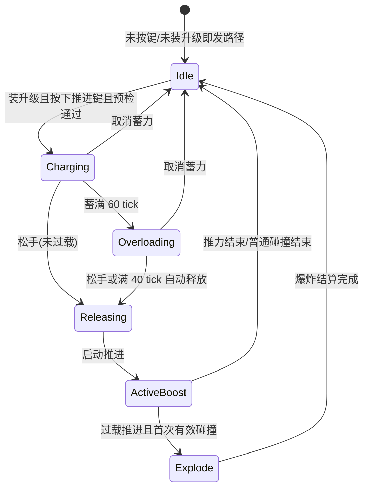
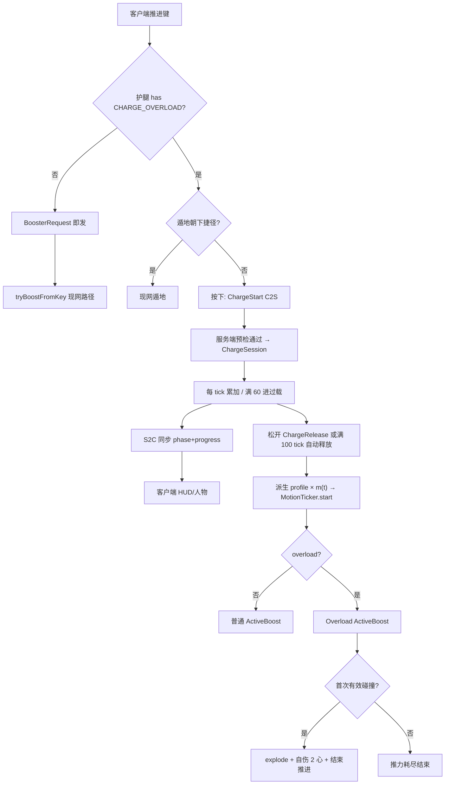

# 蓄力与过载升级项实施方案

> 文档定位：基于 `docs/过载&&蓄力升级实施方案.md` 中的用户原始需求，对照 Booster Mod 代码库现状（推进按键、升级项模型、`BoosterMotionTicker`、反馈与 HUD）整理。本文分为「PRD Break（需求理解与确认）」和「改造方案（技术方案）」两部分。
>
> 范围仅覆盖 **蓄力 + 过载** 这一升级项闭环（长按蓄力、距离随蓄力增长、过载阶段、过载推进碰撞爆炸与自伤、人物/UI 反馈）。不扩展其它升级设想或特殊技巧。
>
> 文件名保留历史「过载&&蓄力」路径；正文业务名统一为 **「蓄力过载」**（见 §4）。

## 原始需求

> 仅结构化整理需求方原始描述，不额外扩展范围；歧义统一收敛到「待确认事项」或「已确认 / 设计决策」。

1. 增加 **长按** 推进器触发时的 **蓄力**。
2. 蓄力上限时间为 **3 秒**；蓄力过程中，人物与 UI 要有蓄力表现，让玩家明确知道正在蓄力。
3. 在 3 秒蓄力窗口内：蓄力时间越久，释放后冲刺距离越远。
4. 蓄力达到 3 秒上限后，进入 **过载** 状态；过载后还可继续蓄力最多 **2 秒**；若仍未释放则 **自动释放**。
5. 过载过程中，人物与 UI 要有过载表现。
6. **过载后释放** 推进的人物，若碰到任何东西——方块、生物（**水和岩浆等液体除外**）——造成一段爆炸；爆炸效果参考 TNT / 苦力怕。
7. 爆炸对周围生物与方块造成伤害与破坏，同时玩家自身扣除 **2 颗心**（4 点生命）血量。

## 第一部分：PRD Break（需求理解与确认）

> 核心目标是理解并确认需求，保证准确性和完整性；不清晰内容形成待办跟踪确认。

### 1. 业务背景

推进器护腿（Booster Mod）已具备：

- 多品质护腿（铜 → 下界合金）与按等级开放的升级槽（2～6）。
- 升级项模型：合成物品 → 放入升级界面 → 服务端读护腿 NBT（`BoostermodUpgradeTypes` / `BoostermodUpgrades`）判定能力；同类型禁重。
- 已实现升级：空中冲刺、遁地、原地起飞、无冷却、随机推进距离、推进破击。
- 推进链路（**现状事实**）：
  - 客户端推进键（默认 `Z`）在 `BoosterInputHandler` 中用 `KeyMapping.consumeClick()` **边沿触发**，发送 `BoosterRequestPayload`。
  - 服务端 `BoosterLeggingsItem.tryBoostFromKey` 校验装备 / 冷却 / 饥饿 / 空中冲刺 / 遁地后，调用 `applyBoost` → `BoosterMotionTicker.start`。
  - `BoosterMotionTicker` 以固定 `BoosterBalanceProfile`（`impulse` / `thrustPerTick` / `thrustTicks`）持续推力；`horizontalCollision` 或推力 tick 耗尽则结束。
  - 成功推进后默认 60 tick 冷却；`BoosterFeedbackPayload` 触发启动反馈（含 Hyper 档）。
  - 现有 HUD（`BoosterHudRenderer`）展示冷却与耐久，**无蓄力进度**语义。

现状问题：

- 推进是「按下即发」的固定距离冲刺，无法通过按键时长主动调节本次距离。
- 没有蓄力 / 过载状态机，也没有过载碰撞爆炸与自伤。
- 输入层只消费点击边沿，不支持长按蓄力与松手释放。

### 2. 需求目标

- 玩家可合成并安装「蓄力过载」升级项；**未安装时**推进输入与距离行为与现网一致（按下即发、固定 profile）。
- 安装后：玩家 **按住** 推进键进入蓄力；松手（或过载超时自动）释放一次推进；**0～3 秒**内蓄力越久，释放后冲刺距离越远。
- 蓄满 3 秒进入过载；过载最多再持续 2 秒；过载阶段人物与 UI 与普通蓄力可区分。
- **过载释放** 后的本次推进中，首次碰到非液体固体方块或实体时触发 TNT/苦力怕式爆炸；爆炸破坏/伤害环境，玩家自伤 2 心。
- 蓄力与过载过程均有可感知的人物与 UI 反馈，避免「不知道有没有在蓄」。

### 3. 需求范围

#### 3.1 本期包含

- 新增升级类型与物品：蓄力过载升级项（定版物品 ID：`charge_overload_upgrade`）。
- 物品注册、创造页、语言文案、**中高阶（钻石主题）** 合成配方；临时 UI 对齐现有升级项（附魔书外观 + tooltip）。
- 安装本升级后的输入改造：长按蓄力、松手释放、过载超时自动释放。
- 服务端蓄力会话状态机：蓄力中 / 过载中 / 释放推进 / 取消。
- 蓄力时长 → 本次推进距离（冲量/推力参数）的映射。
- 过载推进碰撞爆炸（排除水、岩浆等液体）与玩家自伤 2 心。
- 蓄力 / 过载的人物表现（粒子、姿态或镜头等可感知反馈）与 UI 表现（HUD 进度与阶段着色）。
- 同类型升级禁重（复用现有规则）。
- 验收用例与发布验证点。

#### 3.2 本期不包含

- 将蓄力做成 **全员默认**（不装升级也强制长按）。
- 把蓄力与过载拆成 **两个独立升级项**（本期为 **单升级项双阶段**）。
- 非过载蓄力释放后的碰撞爆炸。
- 调整既有升级项数值、槽位数量、冷却基础 60 tick、各品质默认 balance JSON 主结构（蓄力只在当次推进上乘算/替换派生 profile）。
- 特殊技巧（Hyper / Chain 等）的新增或与蓄力的专属连携规则深度设计（Hyper 在过载推进上的叠加见 §8）。
- 领地保护插件、Claim 系统的专用适配（爆炸走原版爆炸权限链，不额外写插件桥）。
- 升级项正式自定义贴图（沿用附魔书临时外观）。
- 过载爆炸后的额外 debuff、着火、击飞专属配置 UI。
- 多人 PvP 平衡专项与队伍友好爆炸开关界面。
- 蓄力过程中允许转向「锁定方向蓄力」（方向仍以释放瞬间视角为准，见 §8）。

### 4. 角色与名词

| 名词 | 本文定义 |
|---|---|
| 推进 / 冲刺 | 由 `BoosterMotionTicker` 持续推力完成的一次运动；一次成功释放对应一次 ActiveBoost |
| 蓄力过载 | **本期能力正式业务名**：安装后启用长按蓄力、距离随蓄力增长、过载阶段与过载爆炸 |
| 蓄力过载升级项 | 可放入护腿升级槽的独立物品；安装后开启上述能力 |
| 蓄力阶段 | 按住推进键后、未满 3 秒前的阶段；进度用于缩放本次冲刺距离 |
| 蓄力上限 | 3.0 秒 = 60 tick（20 TPS） |
| 过载阶段 | 蓄满 3 秒后仍按住的阶段；最长 2.0 秒 = 40 tick；到期自动释放 |
| 过载上限总时长 | 从开始按住起最长 5.0 秒 = 100 tick |
| 释放 | 松手或过载超时，服务端根据当前蓄力 tick 与是否过载启动一次推进 |
| 冲刺距离 | 玩家可观察的当次位移效果；实现上通过对 `impulse` / `thrustPerTick`（及必要时 `thrustTicks`）的缩放体现 |
| 过载推进 | 释放时已处于过载阶段（含自动释放）的一次 ActiveBoost；带「碰撞可爆」标记 |
| 碰撞爆炸 | 过载推进中首次接触非液体阻挡物（方块或实体）时触发的原版风格爆炸 |
| 液体排除 | 水、岩浆及同语义流体方块；接触液体 **不** 触发爆炸 |
| 自伤 | 爆炸触发时对推进玩家扣除 4.0 点生命（2 颗心） |
| 突进器冷却 | 推进器物品在 `player.getCooldowns()` 上的冷却 |

### 5. 主业务流程

1. 玩家合成「蓄力过载升级项」，装入推进器护腿升级槽。
2. 玩家装备该护腿。
3. **未装本升级**：按 Z 仍为现网「按下即发」推进，行为不变。
4. **已装本升级**：
   1. 按下推进键 → 客户端通知服务端开始蓄力（通过冷却 / 饥饿 / 装备 / 空中准入等预检后进入会话）。
   2. 按住期间：服务端每 tick 累加蓄力；客户端展示蓄力进度与人物反馈。
   3. 蓄力 tick 达到 60：进入过载；UI/人物切换为过载表现；距离倍率锁定为蓄满值。
   4. 松手，或过载再满 40 tick：服务端 **释放** 一次推进（应用距离倍率；过载则标记本次可爆）。
   5. 写入冷却（无冷却升级除外）、消耗饥饿/耐久（与现网成功推进一致）、下发启动反馈。
5. 若本次为过载推进：ActiveBoost 期间首次有效碰撞 → 爆炸 + 自伤 2 心 + 结束或保留推进（见 §8）→ 一次推进最多爆炸一次。
6. 蓄力被合法取消（见 §10）时：不启动推进、不写冷却、不耗成功推进资源。

### 6. 功能需求

#### 6.1 升级项物品与安装

##### 6.1.1 触发与前置条件

- 任意玩家可合成 / 创造获取。
- 安装：手持推进器护腿打开升级界面；有可用槽位（与现状一致）。

##### 6.1.2 展示与处理规则

- 新增升级类型与独立物品；`stacksTo(1)`。
- 临时 UI：附魔书外观 + foil + tooltip。
- Tooltip 必须写清：
  - 长按蓄力、松手释放；
  - 蓄力越久冲得越远；
  - 蓄满进入过载，过载释放碰撞会爆炸并自伤 2 心。
- 禁止同类型重复放入。
- 玩家可见名（已确认）：**蓄力过载升级项**。

#### 6.2 长按蓄力与松手释放

##### 6.2.1 触发与前置条件

- 护腿已安装蓄力过载升级。
- 玩家装备推进器（盔甲腿部或 Trinkets `legs/booster`，与现网一致）。
- 按下推进键时通过与现网推进相同的准入预检（冷却、饥饿、空中需空中冲刺、非推进中等）；失败则 **不进入** 蓄力会话。
- 遁地：若已装遁地且大致朝下，**不走蓄力**，保持现网「按下即遁地」捷径（设计决策，避免长按与破方下潜冲突）。

##### 6.2.2 展示与处理规则

- 按住期间处于蓄力会话；松手发送释放请求；服务端以 **自身 tick 累计** 为准，不信任客户端上报的「我蓄了多久」。
- 极短按（几乎立即松手）仍释放一次推进，距离取最低档倍率（见 §8），避免「装了升级就按不出去」。
- 释放瞬间才启动 `BoosterMotionTicker`、扣资源、写冷却；蓄力中途 **不** 扣成功推进资源。
- 释放方向：以释放瞬间视角 / 既有方向解析规则为准（含原地起飞升级时仍竖直向上）。
- 未装本升级时：输入保持 `consumeClick` 即发，**禁止**误入蓄力会话。

#### 6.3 蓄力时长与冲刺距离

##### 6.3.1 触发与前置条件

- 处于蓄力或过载会话并成功释放。

##### 6.3.2 展示与处理规则

- 有效蓄力时间 `t` 钳制在 `[0, 3]` 秒；过载阶段 `t` 固定为 3 秒用于距离计算（过载不继续拉远距离，只解锁爆炸）。
- 距离随 `t` **单调不减**：`t` 越大，可观察冲刺距离越远。
- 实现映射见技术方案 §19 / §20；产品口径：蓄满相对「轻点」倍率 0.85→1.50（约 +76% 冲量/推力系数，可观察更远）。
- 随机推进距离升级：在蓄力倍率应用 **之后** 再套随机 impulse，或明确「随机覆盖基础 impulse 再乘蓄力倍率」——本期采用 **先取当次基础 profile（含随机），再乘蓄力倍率**（设计决策）。

#### 6.4 过载阶段与自动释放

##### 6.4.1 触发与前置条件

- 蓄力会话连续按住达到 60 tick。

##### 6.4.2 展示与处理规则

- 进入过载后 UI/人物切换为过载表现。
- 过载最长再 40 tick；期间松手立即释放过载推进。
- 满 40 tick 仍未松手：服务端自动释放过载推进（不依赖客户端松手包）。
- 过载阶段距离倍率 = 蓄满倍率，不再增加。

#### 6.5 过载碰撞爆炸与自伤

##### 6.5.1 触发与前置条件

- 本次推进释放时已处于过载（含自动释放）。
- ActiveBoost 仍存活。
- 玩家碰撞到 **非液体** 的方块或实体（见 §8 碰撞定义）。
- 本段过载推进尚未爆炸过。

##### 6.5.2 展示与处理规则

- 触发一次原版风格爆炸（视觉与破坏/伤害参考 TNT / 苦力怕；威力见 §8）。
- 爆炸可破坏方块，并伤害 **周围其它生物**；对释放者 **不** 结算本次爆炸范围伤害。
- 对推进玩家仅结算 **固定 2 心（4.0）自伤**（与爆炸范围伤 **不叠加**）。
- **落地（脚碰地面）算有效碰撞**，可触发过载爆炸。
- 水、岩浆等液体接触 **不** 触发爆炸。
- 非过载蓄力释放：碰撞仅走现网结束推进逻辑，**不** 爆炸、**不** 自伤。
- 爆炸触发后 **立即结束** ActiveBoost。
- 创造模式 / 无敌：爆炸环境效果仍可发生时，自伤与玩家受伤遵循原版创造无敌规则（创造不受伤则自伤跳过）。

#### 6.6 蓄力 / 过载反馈（人物与 UI）

##### 6.6.1 触发与前置条件

- 客户端：本地已装升级且按住推进键、或收到服务端蓄力状态同步后。
- 服务端确认进入会话后应同步阶段，避免纯客户端假蓄力骗 UI（权威在服务端；客户端可做预测，但须与服务器状态收敛）。

##### 6.6.2 展示与处理规则

- **UI**：采用 **独立环/条** 展示蓄力进度，布局在 **现有推进 HUD 旁侧或同面板第二态**（不新建整套 UI 体系）。蓄力进度 0～1（对应 0～3 秒）；过载阶段变色/闪烁，使玩家能区分「还在涨距离」与「已过载危险」。
- **人物**：蓄力与过载各至少一种可感知表现；过载强于蓄力。
  - 蓄力：火焰 / 末地烛类粒子，进度增强。
  - 过载：红石 / 岩浆类粒子 + 低频振动/警告音效。
- 释放推进时保留/衔接现有推进启动反馈；过载释放反馈应可感知更强。
- 取消蓄力时进度清零，表现立即停止。

### 7. 验收标准

> 每个本期需求或能力建立一个小节；编号全文唯一且稳定。首次「测试结果」均为「未执行」。

#### 7.1 升级项获取与安装

| 编号 | 给定 | 当 | 则 | 测试结果 |
|---|---|---|---|---|
| AC-01 | 玩家具备配方材料与工作台 | 按配方合成 | 获得 1 个蓄力过载升级项；创造页可见；附魔书临时外观；tooltip 含长按蓄力与过载爆炸自伤说明 | 未执行 |
| AC-02 | 玩家手持铁推进器护腿（3 槽） | 打开升级界面并放入蓄力过载升级项 | 关闭后重开仍在；护腿 NBT 含对应升级类型 | 未执行 |
| AC-03 | 钻石护腿槽内已有一件蓄力过载 | 再向另一空槽放第二件同类型 | 无法放入 | 未执行 |
| AC-04 | 护腿 **未** 装蓄力过载 | 点按推进键 | 行为与现网一致：立即推进，无蓄力 UI、无过载 | 未执行 |

#### 7.2 长按蓄力与释放

| 编号 | 给定 | 当 | 则 | 测试结果 |
|---|---|---|---|---|
| AC-05 | 已装蓄力过载；冷却与饥饿满足；在地面 | 按下推进键不松手 | 进入蓄力；UI 进度上升；人物有蓄力表现；尚未进入 ActiveBoost | 未执行 |
| AC-06 | 同 AC-05 且已蓄力约 1 秒 | 松手 | 启动一次推进；距离可观察地长于「几乎立刻松手」 | 未执行 |
| AC-07 | 已装蓄力过载；推进器在冷却中 | 按下推进键 | 不进入蓄力；无进度 UI | 未执行 |
| AC-08 | 已装蓄力过载；空中且 **未** 装空中冲刺 | 按下推进键 | 不进入蓄力 | 未执行 |
| AC-09 | 已装蓄力过载与空中冲刺；空中 | 长按后松手 | 可蓄力并释放空中推进 | 未执行 |
| AC-10 | 已装蓄力过载；正在 ActiveBoost | 再次按下推进键 | 不开始新的蓄力会话 | 未执行 |

#### 7.3 距离随蓄力增长

| 编号 | 给定 | 当 | 则 | 测试结果 |
|---|---|---|---|---|
| AC-11 | 已装蓄力过载；同一地图直线无障碍；相同品质护腿 | 分别以「轻点松手」与「蓄满 3 秒未过载前松手」释放 | 蓄满的水平位移 **明显大于** 轻点 | 未执行 |
| AC-12 | 已装蓄力过载 | 蓄力 1 秒与蓄力 2 秒各释放一次（控制其它变量） | 2 秒档位移 **不小于** 1 秒档 | 未执行 |
| AC-13 | 已装蓄力过载；进入过载后 1 秒内松手 | 与刚满 3 秒瞬间松手比较位移 | 两者距离 **基本一致**（过载不再拉远距离） | 未执行 |

#### 7.4 过载与自动释放

| 编号 | 给定 | 当 | 则 | 测试结果 |
|---|---|---|---|---|
| AC-14 | 已装蓄力过载；按住不放 | 连续按住超过 3 秒 | UI/人物切换为过载表现 | 未执行 |
| AC-15 | 已装蓄力过载；进入过载后仍按住 | 再持续满 2 秒不松手 | 自动释放一次过载推进，无需客户端松手 | 未执行 |
| AC-16 | 已装蓄力过载；过载中 | 提前松手 | 立即释放过载推进，不等待满 2 秒 | 未执行 |

#### 7.5 过载爆炸与自伤

| 编号 | 给定 | 当 | 则 | 测试结果 |
|---|---|---|---|---|
| AC-17 | 已装蓄力过载；过载释放推进；前方有实心方块墙 | 推进撞墙 | 发生爆炸（破坏/粒子/音效类 TNT 或苦力怕）；墙体可被破坏（在原版可破坏前提下）；推进立即结束 | 未执行 |
| AC-18 | 已装蓄力过载；过载释放推进；前方有生物 | 推进与生物发生有效碰撞 | 触发爆炸并对周围造成伤害；推进立即结束 | 未执行 |
| AC-19 | 已装蓄力过载；过载释放推进；冲入水中 | 仅接触水 | **不** 因水触发爆炸 | 未执行 |
| AC-20 | 已装蓄力过载；过载释放推进；冲入岩浆 | 仅接触岩浆 | **不** 因岩浆触发爆炸（岩浆本身原版伤害仍可存在） | 未执行 |
| AC-21 | 已装蓄力过载；生存模式满血；过载推进撞墙爆炸 | 爆炸结算 | 玩家 **仅** 受到约 2 心固定自伤（在创造/无敌不适用时）；**不** 再叠加本次爆炸范围伤导致远超 2 心的自损 | 未执行 |
| AC-22 | 已装蓄力过载；**非过载** 蓄力释放推进撞墙 | 撞墙 | **不** 爆炸、**不** 因本能力自伤 2 心；推进按现网碰撞结束 | 未执行 |
| AC-23 | 已装蓄力过载；过载推进 | 同一次推进连续撞多个方块 | 至多爆炸 **一次** | 未执行 |
| AC-31 | 已装蓄力过载；过载释放后在空中；下方为实心地面 | 落地接触地面（非流体） | 触发过载爆炸与自伤规则，并立即结束推进 | 未执行 |

#### 7.6 反馈、兼容与构建

| 编号 | 给定 | 当 | 则 | 测试结果 |
|---|---|---|---|---|
| AC-24 | 已装蓄力过载 | 蓄力中 | 可看到现有推进 HUD 旁侧/同面板的 **独立环条** 进度上升，且至少一种人物侧反馈（火/末地烛类粒子） | 未执行 |
| AC-25 | 已装蓄力过载 | 进入过载 | 独立环条进入过载态（变色/闪烁）；人物侧为红石/岩浆类粒子 + 低频振动类反馈，与蓄力可区分 | 未执行 |
| AC-26 | 同时安装蓄力过载与无冷却 | 蓄力释放成功 | 不写冷却；可再次蓄力 | 未执行 |
| AC-27 | 同时安装蓄力过载与原地起飞 | 蓄满释放 | 竖直向上推进，距离仍随蓄力变远 | 未执行 |
| AC-28 | 同时安装蓄力过载、遁地；大致朝下 | 点按推进键 | 走遁地，不进入蓄力 | 未执行 |
| AC-29 | 已装蓄力过载与推进破击；过载或蓄力推进中 | 主动近战命中 | 推进破击仍可触发（互不关闭） | 未执行 |
| AC-30 | 执行 `./gradlew build` | 构建完成 | `BUILD SUCCESSFUL`，新升级项资源打入 jar | 未执行 |

### 8. 核心业务规则

- **启用权威**：服务端 `hasUpgrade(CHARGE_OVERLOAD)`（枚举名以最终实现为准）为唯一准入开关。
- **输入分型**：
  - 未装升级：现网边沿触发即发。
  - 已装升级：按住蓄力 / 松手或超时释放；遁地朝下捷径除外。
- **时间常数（20 TPS）**：

| 阶段 | 时长 | tick |
|---|---|---|
| 蓄力上限 | 3.0 s | 60 |
| 过载窗口 | 2.0 s | 40 |
| 最长按住 | 5.0 s | 100 |

- **距离倍率（已确认；玩测后可再调）**：

| 有效蓄力 t（秒） | 距离倍率 `m(t)`（乘到当次 `impulse` 与 `thrustPerTick`） |
|---|---|
| 0（轻点） | 0.85 |
| 线性插值 | `0.85 + 0.65 * (t / 3)` |
| 3.0（蓄满/过载） | 1.50 |

> `thrustTicks` 默认不变，优先用冲量与每 tick 推力体现「更远」；若实机手感不够再允许同步略增 `thrustTicks`（实现阶段可调，不改需求口径）。

- **过载不增加距离**：`t_eff = min(t, 3s)`。
- **爆炸条件**：仅 `overloadReleased == true` 的 ActiveBoost；首次有效碰撞；非液体。
- **有效碰撞（已确认）**：
  - 方块：`horizontalCollision` 或 `verticalCollision`（**含落地**）且碰撞接触点对应方块 **不是** 流体；
  - 实体：与非自身、可碰撞实体的碰撞箱相交且本 tick 发生阻塞/相交判定为「碰到」；
  - 纯流体方块：不触发。
- **爆炸威力**：`power = 3.0f`（介于小型 TNT 与苦力怕常见观感之间，实现可用 `Level.explode` 等价 API）；`Interaction` 模式可破坏方块（与生存 TNT 类似）。
- **自伤口径（已确认）**：爆炸触发时对释放者 **仅** 施加一次 **固定 4.0** 伤害；释放者 **免疫本次爆炸范围伤**（不叠加）。若玩家处于原版无敌/创造，跳过该自伤。对其它实体仍吃爆炸伤害。
- **一次推进至多一次爆炸**；爆炸后 **立即结束** ActiveBoost（已确认）。
- **冷却与资源**：仅成功释放推进时与现网一致写入冷却与消耗；取消蓄力不消耗。
- **方向**：释放瞬间解析；蓄力过程中允许玩家转身，以松手时朝向为准。
- **与 Hyper**：若释放时满足现有 Hyper 窗口判定，可叠加 Hyper 冲量倍率（先蓄力倍率，再 Hyper）。
- **命名（已确认）**：枚举 `CHARGE_OVERLOAD`；物品 ID `charge_overload_upgrade`；中文「蓄力过载升级项」；英文 Charge Overload Upgrade。
- **配方档位（已确认）**：对齐中高阶升级，采用 **钻石主题** 材料（实现时给出具体 shaped 配方，成本不低于推进破击等中阶项）。

### 9. 页面与数据对象影响

#### 9.1 页面改造矩阵

| 端 | 页面/场景 | 本期改造 |
|---|---|---|
| 客户端 | 升级界面 | 接受新升级项；同类型禁重（已有） |
| 客户端 | 物品名 / Tooltip | 蓄力过载说明 |
| 客户端 | 创造页 / 合成 | 新物品与配方 |
| 客户端 | 推进键输入 | 装升级时改为按住/松开；未装保持即发 |
| 客户端 | HUD | 现有推进 HUD 旁侧/同面板的 **独立环条**；蓄力/过载进度与阶段色 |
| 客户端 | 人物/镜头反馈 | 蓄力（火/末地烛粒子）、过载（红石/岩浆粒子 + 低频振动）、过载释放反馈 |
| 服务端 | 蓄力会话与释放 | 新增状态机 |
| 服务端 | 推进物理 | 当次 profile 倍率；过载碰撞爆炸 |

#### 9.2 数据对象矩阵

| 数据对象 | 调整内容 | 数据来源与去向 | 历史策略 | 确认状态 |
|---|---|---|---|---|
| `BoosterUpgradeType` | 新增 `CHARGE_OVERLOAD` | 物品 → 护腿 NBT → 输入/释放/爆炸 | 旧护腿无类型 = 无蓄力 | 已确认 |
| 护腿升级 NBT | 可存新类型 | 升级菜单 | 未知名 skip（现有） | 现状事实 |
| 服务端蓄力会话 | 新建内存态 | 按键开始/每 tick/释放 | 断线清理 | 已确认 |
| ActiveBoost | 过载可爆 + 已爆标记；爆后立即结束 | 释放时写入 | 推进结束即无 | 已确认 |
| 蓄力状态同步包 | S2C 阶段与进度 | 服务端 → 客户端 HUD/人物 | 无历史 | 已确认 |
| 配方 / 语言 / model | 钻石主题配方 + 文案 + 临时 model | 数据包 / assets | 无 | 已确认 |

### 10. 异常与边界场景

- 未装升级：完全现网路径。
- 蓄力中途进入冷却（外部清 CD 以外一般不会）/ 卸下护腿 / 死亡 / 断线：取消会话，不释放推进。
- 蓄力中切换维度或传送：取消会话。
- 客户端只发松手不发按下：服务端无会话则忽略。
- 客户端伪造超长蓄力：无效；以服务端 tick 为准。
- 过载自动释放时客户端仍显示按住：以服务端释放为准，强制结束会话并同步。
- 爆炸毁坏脚下导致掉虚空：视为原版爆炸风险，不额外保护。
- 同时装随机 impulse：见 §8 叠加顺序。
- 推进破击：不因爆炸替代近战；碰撞爆炸不是推进破击。

### 11. 非功能要求

- **安全**：蓄力时长、是否过载、爆炸与自伤均服务端权威。
- **性能**：蓄力会话按玩家稀疏存储；仅会话中玩家每 tick 更新；爆炸用原版 API，不做大范围自定义扫描。
- **兼容**：无本升级时输入与推进与现网一致；有本升级时不破坏其它升级的独立效果（遁地捷径、破击、无冷却等）。
- **手感**：轻点仍能推进；蓄满有明显距离差；过载有「危险但强」的可读性。
- **构建**：`./gradlew build` 通过；手工 AC 验收（工程无自动化测试）。

### 12. 已确认事项

| 优先级 | 问题 | 确认结论 | 来源 |
|---|---|---|---|
| P0 | 蓄力上限 | 3 秒 | 原始需求 |
| P0 | 过载额外窗口 | 最多再 2 秒，未释放则自动释放 | 原始需求 |
| P0 | 距离与蓄力关系 | 3 秒内越久越远 | 原始需求 |
| P0 | 爆炸触发前提 | **过载后释放** 的推进碰撞才爆炸 | 原始需求 |
| P0 | 爆炸排除 | 水、岩浆等液体不触发 | 原始需求 |
| P0 | 自伤 | 爆炸时玩家扣 2 心 | 原始需求 |
| P0 | 是否需要人物与 UI 反馈 | 蓄力与过载均需要 | 原始需求 |
| P0 | 是否升级项 | **是**（单升级项承载蓄力+过载） | 文档定位「升级实施方案」+ 项目升级项范式 |
| P0 | 未装升级时行为 | 保持现网按下即发 | 设计决策（兼容） |
| P1 | 物品 ID 与枚举命名 | 枚举 `CHARGE_OVERLOAD`；物品 ID **`charge_overload_upgrade`**；中文「蓄力过载升级项」；英文 Charge Overload Upgrade | 用户确认 2026-07-24 |
| P1 | 合成配方档位 | **对齐中高阶**，钻石主题配方；具体 shaped 材料表实现时落盘，成本不低于中阶升级项 | 用户确认 2026-07-24 |
| P1 | 落地是否触发过载爆炸 | **算**；`verticalCollision` / 脚碰地面与撞墙、撞实体同属有效碰撞 | 用户确认 2026-07-24 |
| P1 | 爆炸后推进是否继续 | **立即结束** ActiveBoost | 用户确认 2026-07-24 |
| P1 | 自伤与爆炸范围伤 | **不叠加**：仅固定 2 心自伤；释放者免疫本次爆炸范围伤 | 用户确认 2026-07-24 |
| P1 | 距离倍率曲线 | 轻点 **0.85** → 蓄满 **1.50**（线性）；先按此实现，玩测后再调 | 用户确认 2026-07-24 |
| P2 | 蓄力 HUD 形态 | **独立环/条**；放在现有推进 HUD **旁侧或同面板第二态**，不新建整套 UI 体系 | 用户确认 2026-07-24 |
| P2 | 过载音效/粒子选型 | 蓄力：火焰/末地烛类；过载：红石/岩浆粒子 + 低频振动 | 用户确认 2026-07-24（采纳原建议） |

### 13. 待确认事项

无

### 14. 上游依赖与参考资料

- 原始需求：本文「原始需求」章节（同文件历史草稿）。
- 升级项范式：`docs/多特性升级项化实施方案.md`、`docs/冲刺攻击升级项实施方案.md`。
- 代码现状：
  - 输入：`BoosterInputHandler`、`BoosterModClient`（`KeyMapping`）
  - 请求：`BoosterRequestPayload` → `BoosterLeggingsItem.tryBoostFromKey`
  - 物理：`BoosterMotionTicker`、`BoosterBalanceProfile`
  - 升级：`BoosterUpgradeType`、`BoosterUpgradeHelper`、`BoosterUpgradeItem`
  - HUD/反馈：`BoosterHudRenderer`、`BoosterFeedbackPayload`、`BoosterFeedbackEffects`
- 能力设想背景（**非本期需求来源**）：`docs/推进器能力设计.md` 中「推进带伤害」为碰撞伤另一设想，与本期「仅过载爆炸」不同。
- 当轮确认：用户于 2026-07-24 确认原 §13 全部待确认项（见 §12 新增行）。

### 15. PRD Break 结论

本期定版能力为：**蓄力过载升级项**（`charge_overload_upgrade`）——安装后长按蓄力（上限 3s，距离 0.85→1.50），蓄满进入过载（最多再 2s，超时自动释放）；过载释放的推进在碰到非液体方块（**含落地**）/实体时爆炸，玩家仅固定自伤 2 心且免疫本次爆炸范围伤，爆炸后立即结束推进；蓄力 HUD 为现有推进 HUD 旁的独立环条；蓄力/过载用约定粒子与振动反馈。未安装时推进保持现网即发。

- **需求门禁**：P0/P1/P2 待确认项均为 **0**。
- **可进入 / 已进入技术方案定版状态**；可直接开工实现。

## 第二部分：改造方案（技术方案）

> 基于已确认需求与核验过的现状设计方案；讲清核心改造点与关键流程，不细化到具体代码行。

### 16. 方案目标与设计原则

- **对齐升级模型**：扩展 `BoosterUpgradeType` + 物品 / 配方 / 语言；能力只在安装后生效。
- **服务端权威**：蓄力 tick、过载判定、释放参数、爆炸与自伤只在服务端结算。
- **输入兼容双模**：未装升级保持边沿即发；已装升级走按住/松开，避免破坏老手感与无升级玩家。
- **最小侵入推进物理**：复用 `BoosterMotionTicker`，通过 **当次派生** `BoosterBalanceProfile` 与 ActiveBoost 标记扩展，不推翻推力模型。
- **爆炸用原版能力**：调用世界爆炸 API，避免自写破坏/伤害扫描。
- **反馈可区分**：蓄力 / 过载 / 普通释放 / 过载释放 四态可辨。

### 17. 系统边界与改造范围

| 工程/模块 | 现有职责 | 本期主要改造 | 现状依据 |
|---|---|---|---|
| `upgrade` | 升级类型与物品 | 新增 `CHARGE_OVERLOAD` + 物品 | `BoosterUpgradeType` 含 `BOOST_STRIKE` 等 |
| 客户端输入 | `consumeClick` 即发 | 按是否有升级分支：按住开始 / 松开释放；保留即发路径 | `BoosterInputHandler` |
| 网络 C2S | `BoosterRequestPayload` 单次请求 | 扩展或新增蓄力开始/释放/取消语义 | `BoosterRequestPayload`、`BoosterMod` 注册 |
| 网络 S2C | 推进反馈、HUD 配置 | 蓄力阶段与进度同步；过载释放反馈可扩展 | `BoosterFeedbackPayload`、`BoosterHudStatePayload` |
| 服务端会话 | 无 | 新建蓄力会话表（按玩家 UUID） | 可参考 `BoosterMotionTicker.ACTIVE` 模式 |
| `BoosterLeggingsItem` | `tryBoostFromKey` 即发 | 拆分：预检、开始蓄力、释放推进；遁地捷径保留 | `tryBoostFromKey` |
| `BoosterMotionTicker` | 固定 profile 推力；水平碰撞结束 | 当次倍率 profile；过载碰撞检测；爆炸一次 | `ActiveBoost.step` |
| 客户端 HUD/反馈 | 冷却与耐久条；启动镜头反馈 | 旁侧 **独立蓄力环条**；约定粒子/振动；过载反馈 | `BoosterHudRenderer`、`BoosterFeedbackEffects` |
| 注册 / 资源 | 升级注册与配方 | 新物品、创造页、**钻石主题** recipe、lang、临时 model | `BoosterMod`、`assets`、`data` |

明确不改造：

- 护腿品质槽位表、Trinkets 装备发现路径、推进破击伤害公式、平衡 JSON 文件主 schema、特殊技巧新增。

### 18. 整体架构与数据流

权威数据源：

- 是否启用：护腿 NBT 升级类型。
- 蓄力进度与阶段：服务端 `ChargeSession`。
- 当次是否过载可爆：`ActiveBoost` 标记。
- 冷却：原版 `ItemCooldowns`。
- 距离：当次 `BoosterBalanceProfile` 派生值。

### 19. 领域字段与数据库设计

#### 19.1 字段与枚举

| 业务文案 | API/代码字段 | 持久化字段 | 取值 | 空值含义 |
|---|---|---|---|---|
| 蓄力过载升级 | `BoosterUpgradeType.CHARGE_OVERLOAD` | `BoostermodUpgradeTypes` 元素 | 枚举名 | 无则无蓄力 |
| 物品 ID | `charge_overload_upgrade` | 注册表 | `boostermod:charge_overload_upgrade` | — |
| 蓄力阶段 | `ChargePhase` | 不落盘 | `CHARGING` / `OVERLOADING` | 无会话 |
| 已蓄 tick | `chargeTicks` | 不落盘 | 0～100 | — |
| 距离倍率 | `distanceMultiplier` | 不落盘 | 见 §8 | 释放时计算 |
| 过载推进标记 | `overloadBoost` | 不落盘 | bool | false = 不爆炸 |
| 本段已爆炸 | `hasExploded` | 不落盘 | bool | 防二次爆炸 |

| 类型 | 物品 ID | 中文名（玩家可见） | 英文名 |
|---|---|---|---|
| CHARGE_OVERLOAD | `boostermod:charge_overload_upgrade` | 蓄力过载升级项 | Charge Overload Upgrade |

本 Mod 无传统数据库表。

#### 19.2 表结构与索引

| 存储 | 字段/结构 | 作用 | 写入时机 | 历史与兼容策略 |
|---|---|---|---|---|
| 护腿 CustomData | `BoostermodUpgradeTypes` | 是否拥有蓄力过载 | 升级菜单保存 | 旧数据无新枚举则关闭 |
| 服务端内存 `Map<UUID, ChargeSession>` | phase、ticks、开始时校验快照 | 蓄力会话 | 开始/每 tick/结束 | 断线 remove |
| 服务端内存 ActiveBoost | overload、hasExploded | 碰撞爆炸 | 释放推进时 | 推进结束 remove |
| 网络 S2C | phase、progress01、charging | HUD/人物 | 会话变更或每 N tick | 旧客户端无处理器则忽略（单端 mod 同版本发布） |

### 20. 核心业务流程

#### 20.1 输入双模（客户端）

1. 每 tick 读取推进键状态（`isDown`）与装备升级（客户端可读 NBT 做 UX 分支；真正权威在服务端）。
2. **无升级**：保持 `consumeClick` → 发送现网 `BoosterRequestPayload`（或兼容的即发动作）。
3. **有升级**：
   - 边沿按下：发送 **蓄力开始**；
   - 边沿松开：发送 **蓄力释放**；
   - 可选：按住中周期性心跳（防断线假死），非必须（服务端可用「超时无心跳取消」作增强）。
4. 遁地朝下：可在客户端也优先走即发请求，与服务端捷径一致，避免先蓄后遁。

#### 20.2 蓄力开始（服务端）

1. 校验装备推进器且 `hasUpgrade(CHARGE_OVERLOAD)`。
2. 若已在 `ChargeSession` 或 `isBoosting` → 忽略。
3. 复用现网预检：冷却（除非无冷却升级）、饥饿、空中需空中冲刺等。
4. 遁地升级且大致朝下 → **不建会话**，直接现网遁地路径。
5. 通过则创建 `ChargeSession{chargeTicks=0, phase=CHARGING}`，S2C 同步。

#### 20.3 蓄力 tick（服务端）

1. 每 tick 对所有会话 `chargeTicks++`。
2. `chargeTicks == 60` → `phase=OVERLOADING`，同步过载。
3. `chargeTicks >= 100` → 调用释放逻辑（自动释放，`overload=true`），结束会话。
4. 若玩家失效（离线/死亡/无装备/升级被卸）→ 取消会话，不释放。

#### 20.4 释放推进（服务端）

1. 读取会话 `t_eff = min(chargeTicks, 60)`，`overload = phase==OVERLOADING || chargeTicks>=60`。
2. 计算 `m = 0.85 + 0.65 * (t_eff / 60.0)`。
3. 解析方向（垂直起飞 / 视角）；失败则取消，不写冷却。
4. 取 balance profile；若有随机 impulse 先应用随机；再 `impulse' = impulse * m`，`thrustPerTick' = thrustPerTick * m`。
5. Hyper 判定（若适用）在 `MotionTicker.start` 既有逻辑上叠加。
6. `spendBoostResources`、冷却、音效、`MotionTicker.start(..., overloadFlag)`、反馈包（可带 overload 位）。
7. 清除会话。

#### 20.5 过载碰撞爆炸（服务端）

1. `ActiveBoost.step` 在现有结束条件之外：若 `overloadBoost && !hasExploded`，检测有效碰撞（**含落地 `verticalCollision`**、水平撞墙、实体碰撞；流体跳过）。
2. 触发时：
   - 在玩家位置（或脚位/躯干中心）调用世界爆炸（power=3.0，可破坏，伤害源关联玩家）；
   - 对释放者结算固定 4.0 自伤（创造/无敌跳过）；
   - **释放者排除在本次爆炸实体伤害列表之外**（不与固定自伤叠加）；
   - `hasExploded=true` 并 **立即结束推进**（清理 step height / 破击 reach 等与 `stopBoost` 一致）。
3. 非过载推进：保持现网 `horizontalCollision` 结束，无爆炸。

#### 20.6 取消蓄力

- 明确取消包，或：卸装备、死亡、断线、切换维度、预检条件失效。
- 取消：remove 会话 + S2C progress=0；不推进、不冷却、不消耗。

### 21. 接口改造清单

| 接口能力 | 调用方 → 服务方 | 入参改造 | 出参改造 | 校验与核心处理 | 兼容策略 |
|---|---|---|---|---|---|
| 即发推进 | 客户端 → 服务端 | 保持现网 dir/jump/landing | 无 | 仅无升级或遁地捷径 | 旧行为不变 |
| 蓄力开始 | 客户端 → 服务端 | 可选带 dir 预览；可无方向 | 无 | 升级+预检；建会话 | 无升级则拒绝 |
| 蓄力释放 | 客户端 → 服务端 | 释放瞬间 dirX/dirZ、jump/landing | 无 | 有会话才释放；时长服务端算 | 无会话忽略 |
| 蓄力取消 | 客户端 → 服务端（可选） | 无 | 无 | 清会话 | — |
| 蓄力状态同步 | 服务端 → 客户端 | — | phase、progress、active | 驱动 HUD/人物 | 同版本客户端 |
| 推进启动反馈 | 服务端 → 客户端 | 扩展 overload 标志（或新包） | 客户端更强反馈 | 释放时发送 | 旧 `hyper` 语义保留 |

> 具体可新建 `BoosterChargePayload` 系列，或扩展 `BoosterRequestPayload` 增加 `action` 枚举（START/RELEASE/INSTANT）。推荐 **独立 charge 包 + 保留 request 即发**，降低对推进破击/Hyper 字段的回归风险。

### 22. 前端与交互改造

#### 22.1 推进键与输入

- 检测升级安装状态（客户端读装备 NBT）。
- 有升级：跟踪 `wasDown`/`isDown` 产生开始/释放边沿；避免 `consumeClick` 吞掉长按。
- 无升级：不改变现网。

#### 22.2 HUD

- **独立环/条** 展示蓄力，布局在现有推进 HUD **旁侧或同面板第二态**（不新建整套 UI 体系，不占用冷却/耐久条语义）。
  - `CHARGING`：环/条进度 0～1（对应 0～3 秒；颜色如白→橙）。
  - `OVERLOADING`：满进度 + 脉冲/红色闪烁，表达危险；过载 2 秒窗口可用第二段环或闪烁频率表达「即将自动释放」。
- 无会话时不显示该独立环/条。

#### 22.3 人物与镜头

- 蓄力：火焰 / 末地烛类粒子（脚底或背后），可随进度增强；可选轻微 FOV。
- 过载：红石 / 岩浆类粒子更密 + 低频振动/警告音效。
- 释放：复用并扩展 `BoosterFeedbackEffects`；过载释放可用更强前兆音效（真正爆炸仍由服务端世界事件驱动客户端原版爆炸表现）。

#### 22.4 文案

- `zh_cn` / `en_us`：物品名、tooltip、键位分类不变。
- tooltip 明确自伤与过载风险。

### 23. 兼容性、异常与一致性处理

#### 23.1 历史与版本兼容

- 旧护腿 NBT 无新类型：行为完全旧版。
- 新类型写入既有 list；`BoosterUpgradeHelper` 对未知枚举 skip 的现状可继续保护向前兼容。
- 单端 Fabric mod：发布时客户端与服务端同版本；不做长期混版本协议承诺。

#### 23.2 错误场景

| 场景 | 处理 |
|---|---|
| 蓄力中冷却被外部加上 | **允许完成当前会话**；释放成功时按是否无冷却升级写入冷却 |
| 释放时贴墙无前向空隙 | 与现网一致：不启动推进、不写冷却、不耗成功推进资源 |
| 爆炸毁图 | 原版爆炸规则；不额外回滚方块 |
| 重复释放包 | 会话已清则忽略（幂等） |

#### 23.3 一致性和幂等

- 权威：服务端会话 tick 与 ActiveBoost 标记。
- 释放与自动释放同一 `releaseCharge` 入口，避免双路径不一致。
- 爆炸 `hasExploded` 保证一次。
- 断线：`DISCONNECT` 时取消会话 + 取消 ActiveBoost（现网已 cancel boost）。

### 24. 发布、回滚与验证方案

#### 24.1 发布顺序

1. 资源与注册（物品、配方、语言、model）。
2. 服务端：升级类型、会话、释放倍率、过载爆炸。
3. 网络包注册（C2S/S2C）。
4. 客户端：输入双模、HUD、反馈。
5. 同版本 jar 发布（客户端+服务端）。

#### 24.2 回滚与观察

- 回滚：回退 mod 版本；护腿 NBT 中未知类型已被 skip，旧版本忽略新枚举即可安全游玩（失去能力）。
- 观察：试玩确认 0.85→1.50 距离手感、过载落地自爆节奏、爆炸 power=3.0 毁图程度；必要时只调数值不改状态机。

#### 24.3 核心验证点

- AC-01～AC-31 手工验收（含落地爆炸 AC-31）。
- 回归：无升级即发、遁地、垂直起飞、无冷却、随机 impulse、推进破击、Hyper 窗口。
- 安全：篡改客户端「声称蓄满」不能超过服务端 tick 对应倍率。
- 构建：`./gradlew build`。

### 25. 需求追踪矩阵

| 需求/规则 | 设计落点 | 数据或接口影响 | 验证点 | 状态 |
|---|---|---|---|---|
| 长按蓄力 | §6.2、§20.1～20.3 | ChargeSession、C2S start | AC-05 | 已覆盖 |
| 蓄力上限 3s | §8、§20.3 | 60 tick | AC-14 | 已覆盖 |
| 越久越远 | §6.3、§20.4 | profile 倍率 | AC-11～13 | 已覆盖 |
| 蓄力人物+UI | §6.6、§22 | S2C 状态、HUD | AC-24 | 已覆盖 |
| 过载 +2s 自动释放 | §6.4、§20.3 | 100 tick 自动 release | AC-14～16 | 已覆盖 |
| 过载人物+UI | §6.6、§22 | phase=OVERLOADING | AC-25 | 已覆盖 |
| 过载碰撞爆炸 | §6.5、§20.5 | ActiveBoost 标记、explode | AC-17～18、23 | 已覆盖 |
| 落地也爆炸 | §6.5、§8、§20.5 | verticalCollision | AC-31 | 已覆盖 |
| 排除液体 | §6.5、§8 | 碰撞过滤 | AC-19～20 | 已覆盖 |
| 自伤 2 心且不叠爆炸伤 | §6.5、§8、§20.5 | 固定 4.0 + 释放者免疫范围伤 | AC-21 | 已覆盖 |
| 爆后立即结束推进 | §6.5、§20.5 | stopBoost | AC-17、AC-31 | 已覆盖 |
| 非过载不爆炸 | §6.5 | overload 标志 | AC-22 | 已覆盖 |
| 升级项安装 | §6.1 | `charge_overload_upgrade` | AC-01～03 | 已覆盖 |
| 未装保持即发 | §3、§20.1 | 输入双模 | AC-04 | 已覆盖 |
| 与其它升级共存 | §10、§20 | 遁地捷径等 | AC-26～29 | 已覆盖 |
| 独立蓄力环条 HUD | §6.6、§22.2 | S2C 状态 + HUD | AC-24～25 | 已覆盖 |
| 约定粒子/振动 | §6.6、§22.3 | 客户端表现 | AC-24～25 | 已覆盖 |

### 26. 本期不实现的技术能力

- 蓄力全员默认化、双升级项拆分。
- 非过载碰撞爆炸、推进全程碰撞伤（与推进破击/旧「推进带伤害」设想不同）。
- 爆炸领地插件桥、PvP 队伍开关 UI。
- 蓄力方向锁定、蓄力中预瞄准线。
- 正式自定义升级贴图。
- 特殊技巧新体系与蓄力的专属连招表。
- 自动化单元测试框架引入。
